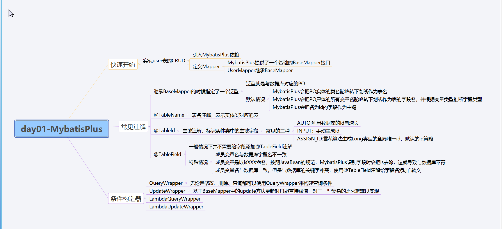

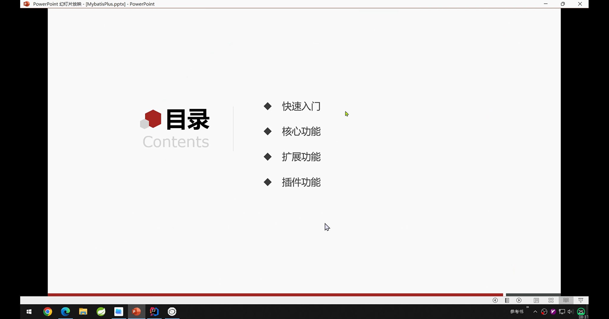

```java
mybatis:
  mapper-locations: classpath*:mapper/*.xml
  
<dependency>
        <groupId>org.mybatis.spring.boot</groupId>
        <artifactId>mybatis-spring-boot-starter</artifactId>
        <version>2.2.2</version>
</dependency>
```

当if条件不成立的时候，就会查找整张表，这在开发中是不可被接受的

```java
<select id="queryUserByIds" resultType="com.itheima.mp.domain.po.User">
    SELECT id, username, password, phone, info, status, balance, create_time, update_time
    FROM user
    <if test="ids != null">
        WHERE id IN
        <foreach collection="ids" open="(" close=")" item="id" separator=",">
            #{id}
        </foreach>
    </if>
    LIMIT 10
</select>
```

如果使用myabtis的话，非常的麻烦，需要写大量的代码

使用mybatisplus

第一步导包

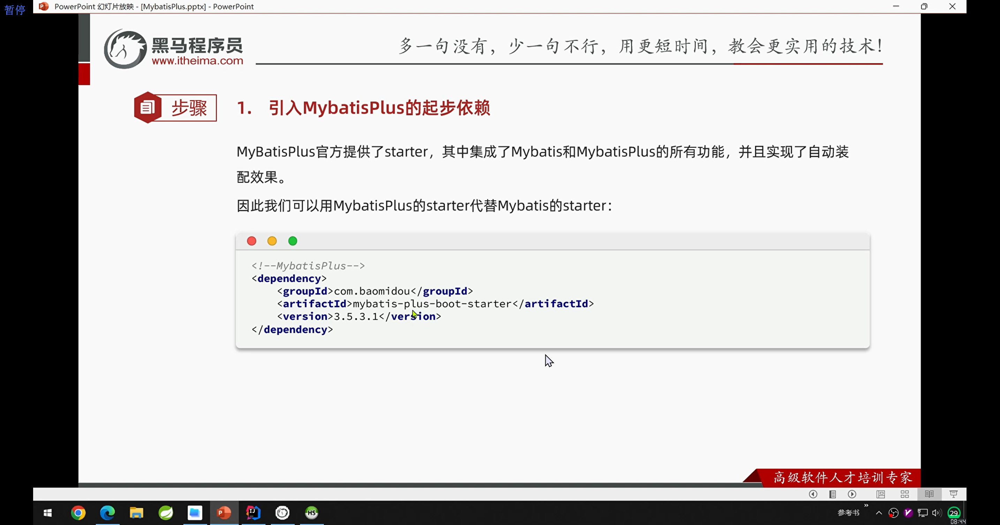

需要注意的是，mybatis-plus的starter自带mybatis的功能。因此就不再需要原来的mybatis的starter

第二步，定义mapper

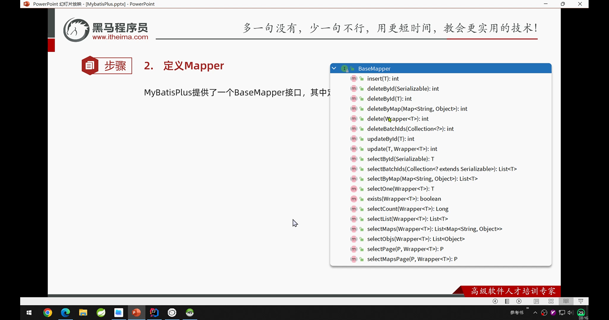

原来是需要写大量的myabtis的单条语句。而由于BaseMapper写了大量的CRUD的接口，所以就不需要自己写了

解析：MyBatis 将 XML 映射文件解析并构建为 MappedStatement 对象。

生成statement的全过程：

第一步：扫描与读取

MyBatis 根据配置 mapper-locations: classpath*:mapper/*.xml，找到所有的 XML 文件，并将它们读入内存，解析成 XML 文档树。

第二步：解析标签 (Parse Tags)

MyBatis 遍历 XML 中的每一个标签（如 <select>, <insert>, <update>, <delete>）。

```java
<select id="selectById" resultType="com.example.User">
    SELECT * FROM user WHERE id = #{id}
</select>
```

第三步：构建MapperStatement

MyBatis 会为上面的 <select> 标签创建一个 MappedStatement 对象。这个对象里存了什么？

ID: com.example.mapper.UserMapper.selectById (命名空间 + 标签ID)

SQL Source: 解析后的 SQL 对象（处理了 ${} 和 #{} 占位符逻辑）。

Command Type: SELECT。

Parameter Map: 知道 #{id} 对应方法参数的 id。

Result Map: 知道查询结果要转换成 com.example.User 类。

第四步：注册到 Configuration (Register)

```java
// 伪代码
configuration.addMappedStatement("com.example.mapper.UserMapper.selectById", mappedStatementObj);
```

第五步：绑定 Mapper 接口 (Bind Interface)

MyBatis 使用 JDK 动态代理，为 UserMapper 接口生成一个代理对象。当你调用 userMapper.selectById(1L) 时：代理对象拦截这个方法调用。它拿着方法名 selectById 去那个“大地图”里找对应的 MappedStatement。找到后，拿出里面的 SQL 和配置，去数据库执行。

逻辑如下

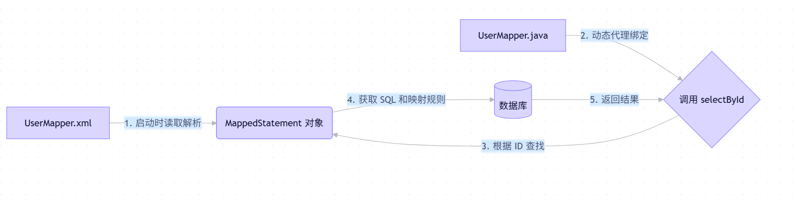

如果不生成statement，每次调用都要重新解析XML文本，速度非常慢

生成statement的意义在于

1. 性能优化：XML只在启动的时候解析一次，生成内存对象。运行时直接拿对象执行，速度飞快

1. 类型安全：在启动阶段，如果XML写错了（比如字段名不对、类名找不到），MyBatis会在生成Statement时直接报错，让你启动失败，而不是等到运行时报错

1. 解耦：让Java接口和XML SQL通过ID动态关联起来，不需要硬编码SQL字符串在Java代码里

总结：生成statement，就是Mybatis在启动时，把写的XML里的死SQL模版，加工成了内存里的活的执行指令对象（MapperStatement），方便你的Java代码能随时调用它去查数据库

前面提到的BaseMapper写了CRUD的方法，那么这些方法会生成statement来执行sql语句

所以，我们的方法继承BaseMapper即可

入门案例

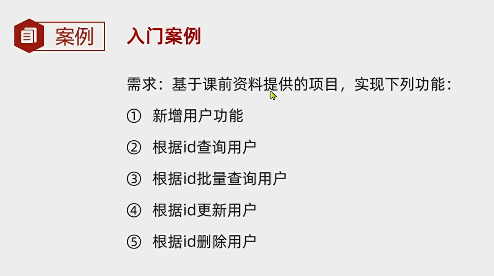

```java
//把@Mapper给注释掉
public interface UserMapper extends BaseMapper<User> {
    List<User> queryUserByIds(@Param("ids") List<Long> ids);
}
```

如果不想在mapper中的interface中添加@Mapper注解，就需要再Application处添加

```java
@MapperScan("com.itheima.mp.mapper")
```

测试

```java
  @Test
   
    //新增用户
    @Test
    void testSaveUser(){
        User user = new User();
        user.setId(5L);
        user.setUsername("Lucy");
        user.setPassword("123");
        user.setPhone("18688990011");
        user.setBalance(200);
        user.setInfo("{\"age\": 24, \"intro\": \"英文老师\", \"gender\": \"female\"}");
        user.setCreateTime(LocalDateTime.now());
        user.setUpdateTime(LocalDateTime.now());
        userMapper.insert(user);
    }

    //根据id查询
    @Test
    void testGetById(){
        User user = userMapper.selectById(5L);
        System.out.println(user);
    }
    //根据id批量查询
    @Test
    void testGetByIds(){
        List<User> users = userMapper.selectBatchIds(List.of(1L, 2L, 3L));
        users.forEach(System.out::println);
    }

    //更新
    @Test
    void testUpdateUser(){
        User user = new User();
        user.setId(5L);
        user.setUsername("Loser");
        user.setPassword("123");
        userMapper.updateById(user);
        User selectById = userMapper.selectById(5L);
        System.out.println(selectById);
    }

    //删除
    @Test
    void testDeleteUser(){
        userMapper.deleteById(5L);
        User user = userMapper.selectById(5L);
        System.out.println(user);
    }

```

mybatisplus是对大量的单条常用sql和mapper进行了封装

**Mybatisplus使用的是约定大于配置的思想**

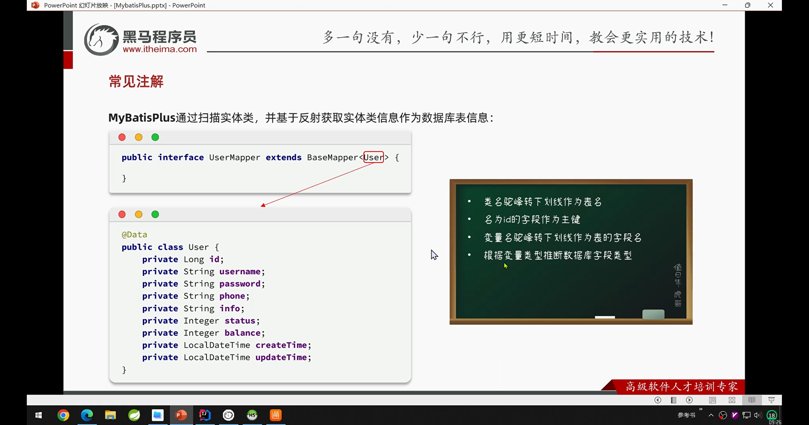

通过反射获取到实体User，然后通过User就可以获得表的信息。

而约定大于配置，约定有：

1. 类名驼峰转下划线作为表名

1. 名为id的字段作为主键

1. 变量名驼峰转下划线作为表的字段名

1. 根据变量类型推断数据库字段类型

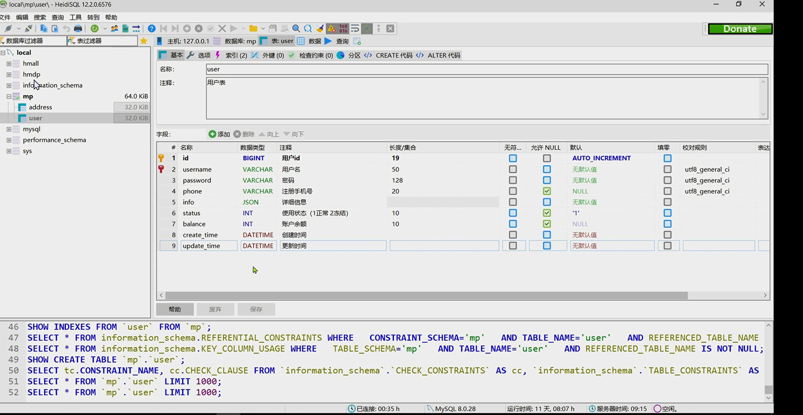

但是，当实体类的字段名和数据库不一致的时候，怎么办？

注解！

**@TableName	主要针对的是表名不一致的事情**

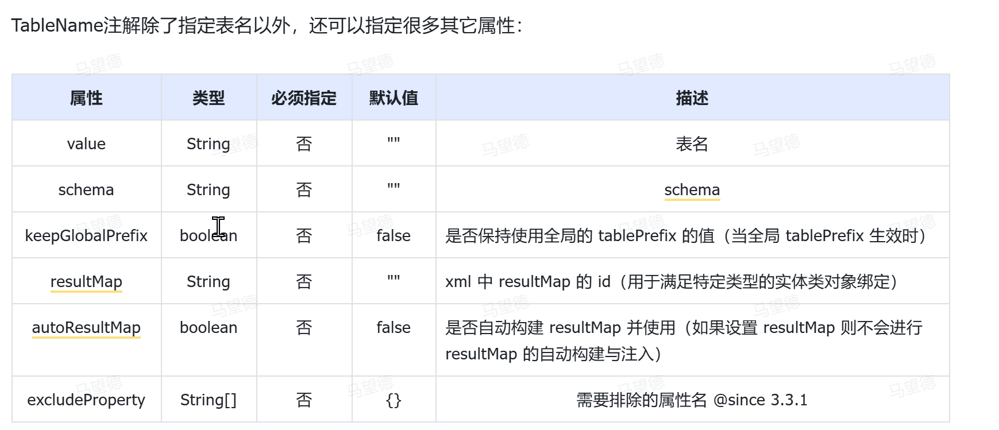

一般就是使用一个value用来注解名字，很多是用不到的

```java
@TableName("user")
public class User {
    private Long id;
    private String name;
}
```

**@TableId	针对的是主键不一致的事情**

```java
@TableName("user")
public class User {
    @TableId
    private Long id;
    private String name;
}
```

@TableId支持的类型有

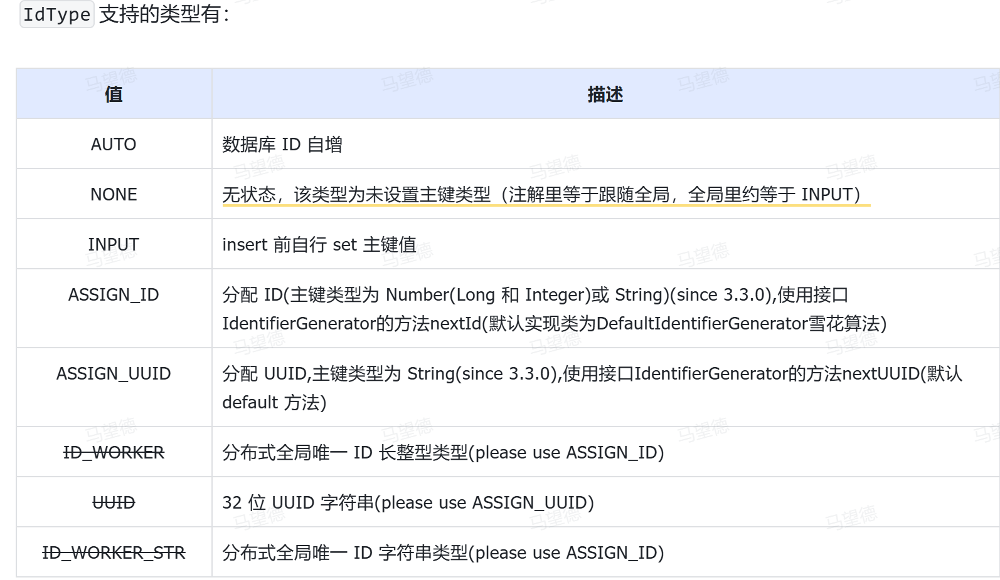

这里比较常见的有三种：

- AUTO：利用数据库的id自增长

- INPUT：手动生成id（需要自己通过手动编码的形式输入Id）

- ASSIGN_ID：雪花算法生成Long类型的全局唯一id，这是**默认（没有配置任何id策略的情况下）**的ID策略。（就是自动生成一个id）

**@TableField 主要针对的是字段名不一致的情况的注解**

注意@TableId一定要标记一下，因为如果不标记的话，那么mybatisplus就会主动找一个名为Id的主键，如果找不到，就完蛋了。

```java
@TableName("user")
public class User {
    @TableId
    private Long id;
    private String name;
    private Integer age;
    @TableField(is_married")
    private Boolean isMarried;
    @TableField("`concat`")
    private String concat;
}
```

一般情况下我们并不需要给字段添加@TableField注解，一些特殊情况除外：

- 成员变量名与数据库字段名不一致

- 成员变量是以isXXX命名，按照JavaBean的规范，MybatisPlus识别字段时会把is去除，这就导致与数据库不符。

- 成员变量名与数据库一致，但是与数据库的关键字冲突。使用@TableField注解给字段名添加转义字符：``

支持的其它属性如下：

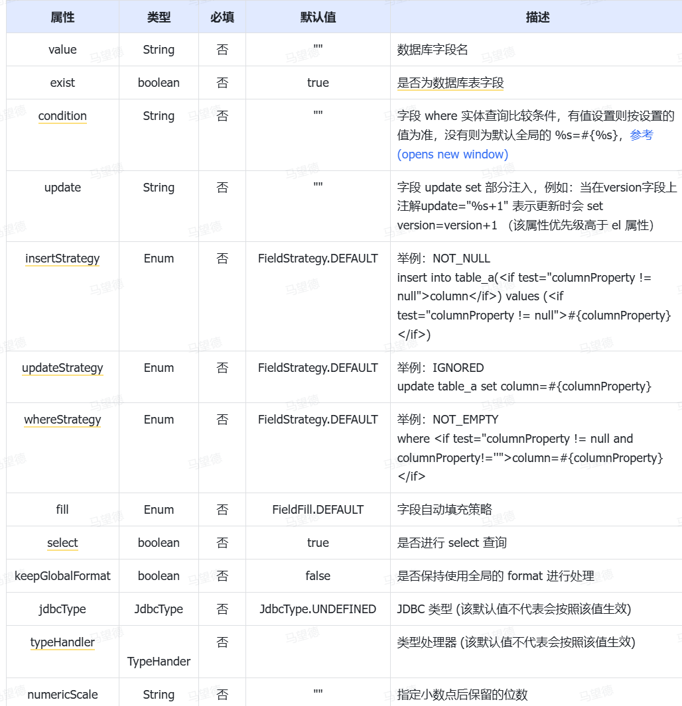

updateStrategy：就是我更新数据表字段的时候，使用的什么方案去处理的。举例，IGNORE, update table a set column = #{columProperty}，那这个字段更新的时候就永远不会被更新。而如果填的事NOT NULL，那就是当它非空的时候，我就更新。但是像这样的一个个更新，用的比较少。

常用的是vlaue指定一下名字

还有就是常用的是typeHandler，因为java类型要和数据库类型做转化，那么转化就需要转化器。大多数的常用类型mybatis自动就转化了。而只有一些特别的，需要自己自定义类型处理器。

雪花算法：全局唯一id的实现方案：...

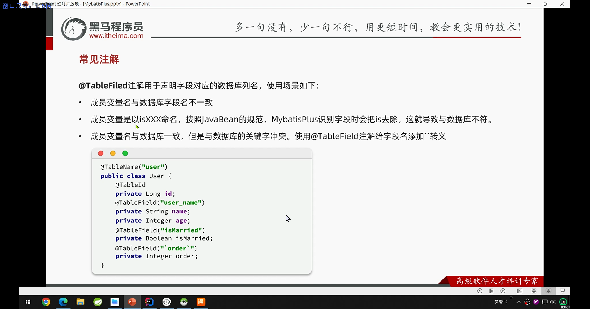

```java
 @TableField(exist = false)
    private String username;
```

当exist = false的时候，代表的是，当前的字段不属于该数据库

如果字段名为关键字的话，那就是这样

```java
  @TableField(value = "`username`")
    private String username;
```

这样就解决了关键字冲突的问题

**MybatisPlus中的常见配置**

```java
mybatis:
  mapper-locations: classpath*:mapper/*.xml
```

显示的是：Cannot resolve configuration property 'mybatis.mapper-locations'

说明这个mybatis的配置失效了

那么myabtis岂不是不知道mapper中的配置了？

测试显示的是，原来myabtis情况下的xml中的mapper的sql竟然还是可以使用的！

这是因为，原来约定好的，约定大于配置 

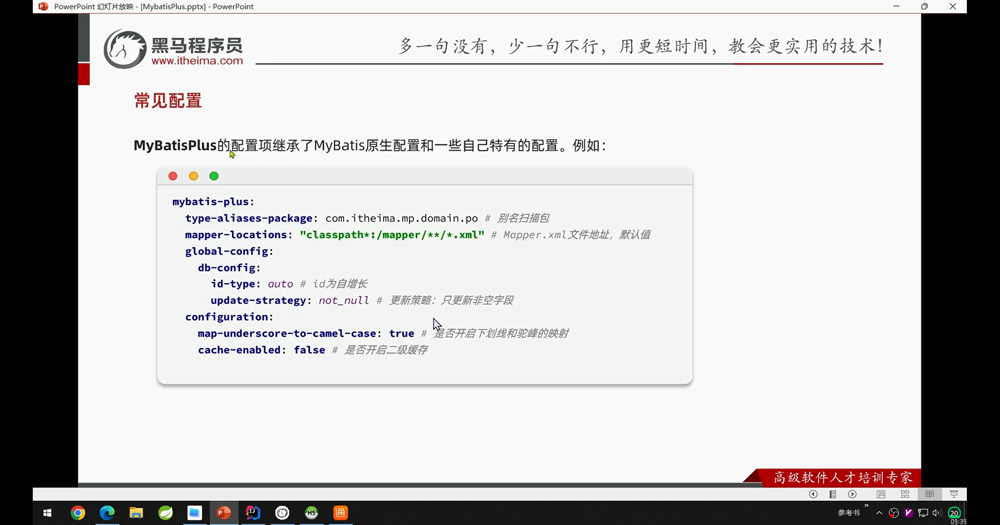

```yaml
#此时可以使用xml中的sql的时候，我的配置是
spring:
  datasource:
    url: jdbc:mysql://localhost:3306/itheima_mp_demo?useUnicode=true&characterEncoding=UTF-8&autoReconnect=true&serverTimezone=Asia/Shanghai&rewriteBatchedStatements=true
    driver-class-name: com.mysql.cj.jdbc.Driver
    username: root
    password: 123456
logging:
  level:
    com.itheima: debug
  pattern:
    dateformat: HH:mm:ss
mybatis:
  mapper-locations: classpath*:mapper/*.xml
  

————————————————————————————————————————————————————————————————————————————————————————————————


mybatis-plus:
  type-aliases-package: com.itheima.mp.domain.po # 别名扫描包
 mapper-locations: classpath*:mapper/**/*.xml # Mapper.xml文件地址，默认值
  global-config:
    db-config:
      id-type: auto # id为自增长
      update-strategy: not_null # 更新策略：只更新非空字段
  configuration:
    map-underscore-to-camel-case: true # 是否开启下划线和驼峰的映射
    cache-enabled: false # 是否开启二级缓存
```

可以看到，mapper-locations的配置显示，只要你把sql对应的xml放到mapper之下就可以扫描到

```
type-aliases-package: com.itheima.mp.domain.po # 别名扫描包
```

这个是别名，配置了这个之后，resultType就不用返回全名了。省去了 resultType="com.itheima.mp.domain.po.User"

```xml
<select id="queryUserByIds" resultType="User">
        SELECT id, username, password, phone, info, status, balance, create_time, update_time
        FROM user
        <if test="ids != null">
            WHERE id IN
            <foreach collection="ids" open="(" close=")" item="id" separator=",">
                #{id}
            </foreach>
        </if>
        LIMIT 10
    </select>

```

第二部分：

mybatisPlus的核心功能

更复杂的CRUD

因此引入：

条件构造器：where

自定义sql：复杂查询的时候使用

service：有一些service层就只是调用一些mapper（连单表的service层都不用写了）

静态工具：脱离service、mapper直接实现查询CURD

条件构造器：where

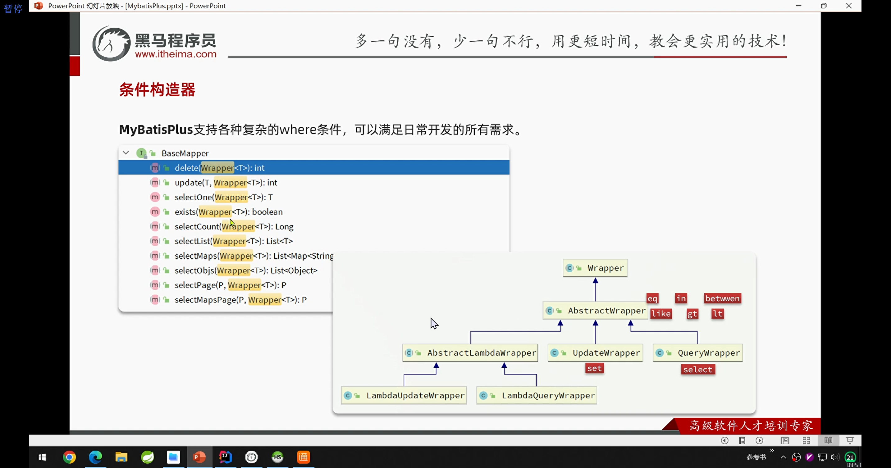

这个Wrapper就是一个条件构件器。

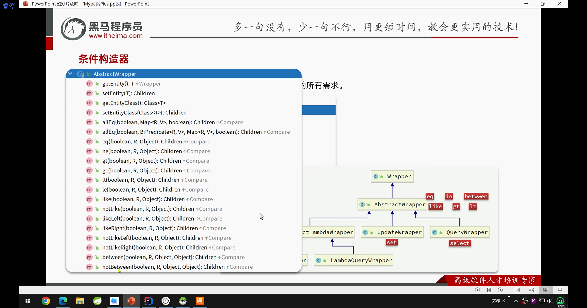

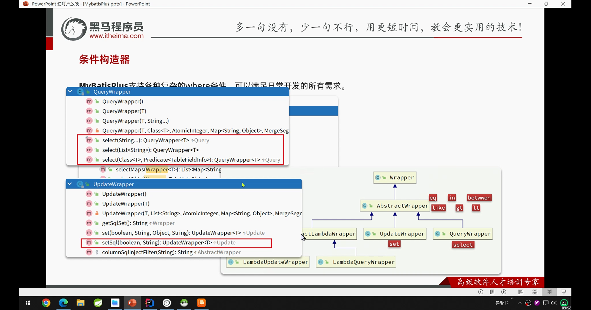

UpdateWrapper和QueryWrapper就是在前面的基础上多了set和select

案例：

1 查询出名字中带o的，存款大于等于1000元的人的id、username、info、balance字段

2 更新用户名为jack的用户余额为2000

```java
/**
     * 查询出名字中带o的，存款大于等于1000元的人的id、username、info、balance字段
     */
    @Test
    void testQueryWapper1() {
        QueryWrapper<User> queryWrapper = new QueryWrapper<>();
        queryWrapper.select("id", "username", "balance", "info").like("username", "o").ge("balance", 1000);

        List<User> users = userMapper.selectList(queryWrapper);
        users.forEach(System.out::println);
    }

  
    /**
     *更新用户名为jack的用户余额为2000
     */
    @Test
    void testQueryWapper2() {
        UpdateWrapper<User> updateWrapper = new UpdateWrapper<>();
        updateWrapper.eq("username", "jack");

        User user = new User();
        user.setBalance(2000);
        userMapper.update(user, updateWrapper);
    }
```

需求：

更新1 、2 、3的用户的余额，扣200块钱

```java

    /**
     * 更新1 、2 、3的用户的余额，扣200块钱
     * 只能在sql语句中减，因为如果先查再减，并发好几个人减怎么办？
     */
    @Test
    void testQueryWapper3() {
        UpdateWrapper<User> updateWrapper = new UpdateWrapper<User>()
                .setSql("balance = balance - 200")
                .in("id", 1L, 2L, 3L);
        userMapper.update(null, updateWrapper);
    }
```

这里为什么一定要用updateWrap，而不是"先查后减"

**问题一：并发竞争**

场景设定：以扣200元为例。用户id = 1；初始余额为1000元；有两个请求（比如两个用户同时下单），都要从这个账户扣200元（这里的两次请求都应该合法扣款——1000 -200 -200 = 600元）

如果使用“先查后减”，可能得到错误的结果,比如800元

并发竞争原理：

```java
// 假设这是在一个方法里
User user = userMapper.selectById(1L);        // ① 查
user.setBalance(user.getBalance() - 200);     // ② 改
userMapper.updateById(user);                  // ③ 写
```

两个并发的线程的执行流程

| 时间 | 线程 A（请求1） | 线程 B（请求2） | 
| -- | -- | -- |
| t1 | 执行 | （还没开始） | 
| t2 | （计算中） | 执行 | 
| t3 | 执行 | （计算中） | 
| t4 | （完成） | 执行 | 


最终的结果是id-1的user的balance = 800；

正确的做法是数据库的原子更新：

```java
UPDATE user SET balance = balance - 200 WHERE id = 1;
```

**问题二：事务可以解决吗？**

事务不能解决这个问题。因为事务的默认隔离级别是**READ COMMITTED**（读已提交），它的行为是“每次select都会读取最新的已提交数据”。但是在“先查后减”中，线程a、b都在t1时刻读到了1000，都提交的balance是800；

如何用事务+锁来解决？

将事务的隔离级别设置为悲观锁。这样性能就很差了

```java
@Transactional
public void deduct(Long userId) {
    User user = userMapper.selectByIdForUpdate(userId); // 加锁
    user.setBalance(user.getBalance() - 200);
    userMapper.updateById(user);
}
```

**问题三：性能问题**

“先减后查”，3个用户一共6次访问数据库

```java
1. SELECT * FROM user WHERE id = 1;
2. SELECT * FROM user WHERE id = 2;
3. SELECT * FROM user WHERE id = 4;
4. UPDATE user SET balance = 800 WHERE id = 1;
5. UPDATE user SET balance = 1800 WHERE id = 2;
6. UPDATE user SET balance = 1300 WHERE id = 4;
```

updatewrap流程：一次访问

```java
userMapper.update(null, 
    new UpdateWrapper<User>()
        .in("id", 1, 2, 4)
        .setSql("balance = balance - 200")
);
```

**基于lambdaQueryWrapper的查询**

需求：查询出名字中带o的，存款大于等于1000元的人的id、username、info、balance字段

```java

    /**
     * 查询出名字中带o的，存款大于等于1000元的人的id、username、info、balance字段
     */
    @Test
    void testQueryWapper4() {
        LambdaQueryWrapper<User> wrapper = new LambdaQueryWrapper<User>()
                .select(User::getId, User::getUsername, User::getInfo, User::getBalance)
                .like(User::getUsername, "o")
                .ge(User::getBalance, 1000);

        List<User> users = userMapper.selectList(wrapper);
        users.forEach(System.out::println);
    }

    /**
     * 更新1 、2 、3的用户的余额，扣200块钱
     * 只能在sql语句中减，因为如果先查再减，并发好几个人减怎么办？
     */

    @Test
    void testQueryWapper5() {
        LambdaUpdateWrapper<User> wrapper = new LambdaUpdateWrapper<User>().setSql("balance = balance + 3000")
                .in(User::getId, 1L, 2L, 3L);

        userMapper.update(null, wrapper);
    }
```

**自定义sql**

也就说把mybatisplus这种条件构建器的功能和手写sql结合起来

setSql("balance = balance - 200")出现在业务层

问题：如果mapper写在业务层在某些公司里是不被接受的；

使用sql比较繁杂，但是不使用sql就需要把wrapper写到service层

我们知道，在xml中写的sql，where条件是最复杂的，那么能不能只在xml的sql里只写set语句，而where语句通过mybatisplus来写呢？

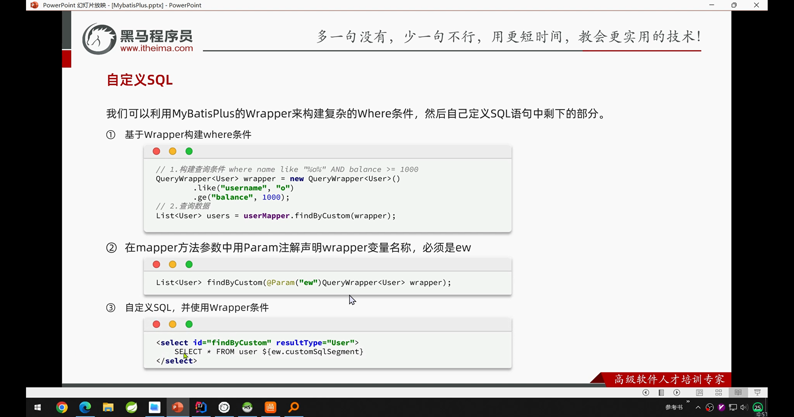

需求：将id在指定范围的用户（例如1、 2、 4）的余额扣减指定值，不允许在service层出现SQL语句

```java
@Test
void testCustomSql() {
    List<Long> ids = List.of(1L, 2L, 4L);
    int amount = 200;
    // 1.定义条件
    QueryWrapper<User> wrapper = new QueryWrapper<User>()
            .in("id", ids);
    // 2.执行更新
    userMapper.updateBalanceByWrapper(amount, wrapper);
}

@Update("UPDATE user SET balance = balance - #{amount} ${ew.customSqlSegment}")
void updateBalanceByWrapper(@Param("amount") int amount, @Param("ew") QueryWrapper<User> wrapper);

 @Test
    void testQueryWapper7() {
        UpdateWrapper<User> updateWrapper = new UpdateWrapper<User>().in("id", 1L, 2L, 4L);

        userMapper.updateBalanceByWrapper(200, updateWrapper);

        QueryWrapper<User> queryWrapper = new QueryWrapper<User>().in("id", 1L, 2L, 4L);
        List<User> users = userMapper.selectList(queryWrapper);
        users.forEach(System.out::println);
    }
```

**${ew.customSqlSegment} 用来代替<where>及其包含的内容**

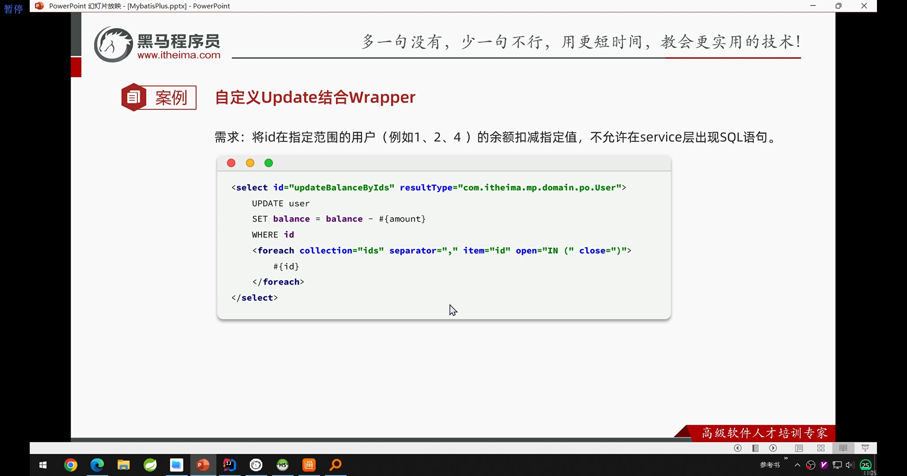

mybatisplus只能做单表的CRUD，做不了多表。

为什么做不了多表？

因为BaseMapper要指定实体类。

那多表怎么办？

还是要回复到原来的手写SQL

但是，有些情况，可以通过自定义SQL来实现自定义查询

多表联查

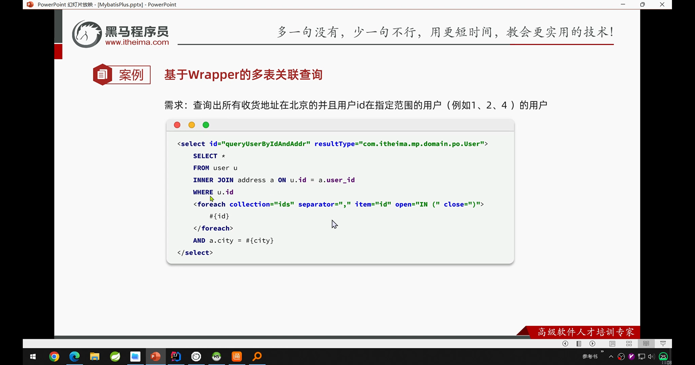

案例：查询所有收货地址在北京，并且用户id在指定范围的用户(例如1、 2、 4)的用户

```xml
<select id="queryUserByIdAndAddr" resultType="com.itheima.mp.domain.po.User">
        SELECT *
        FROM user u
        JOIN address a ON u.id = a.user_id
        WHERE
        u.id IN
        <foreach collection="ids" separator="," item="id" open="(" close=")">
            #{id}
        </foreach>
        AND a.city = #{city}
    </select>
```

```java
@Test
void testMultiTableQuery() {
    List<Long> ids = List.of(1L, 2L, 4L);
    String city = "北京";

    QueryWrapper<User> wrapper = new QueryWrapper<User>()
            .in("u.id", ids)
            .eq("a.city", city);

    List<User> users = userMapper.queryUsersByWrapper(wrapper);
    users.forEach(System.out::println);
}

List<User> queryUsersByWrapper(@Param("ew") QueryWrapper<User> wrapper);

<select id="queryUsersByWrapper" resultType="com.itheima.mp.domain.po.User">
        SELECT u.*
        FROM user u
                 INNER JOIN address a on u.id = a.user_id
            ${ew.customSqlSegment}
    </select>
    


//测试
  @Test
    void testQueryWapper8(){
        List<Long> ids = List.of(1L, 2L, 4L);
        String city = "北京市";

        QueryWrapper<User> queryWrapper = new QueryWrapper<User>()
                .eq("a.city", city)
                .in("u.id", ids);

        List<User> users = userMapper.queryUsersByWrapper(queryWrapper);
        users.forEach(System.out::println);

        List<User> list = userMapper.queryUserByIdAndAddr(city, ids);
        list.forEach(System.out::println);
    }
```

最核心的思想就是把比较where部分交给mybatisplus的wrapper去处理

**总结就是：BaseMapper中需要传入实体类，导致只能单表查询。而多表查询，也只是将where的部分用wrapper替代掉了而已。不过面对十分复杂的查询的时候，wrapper的查询方式还是太过牵强。**

**service接口**

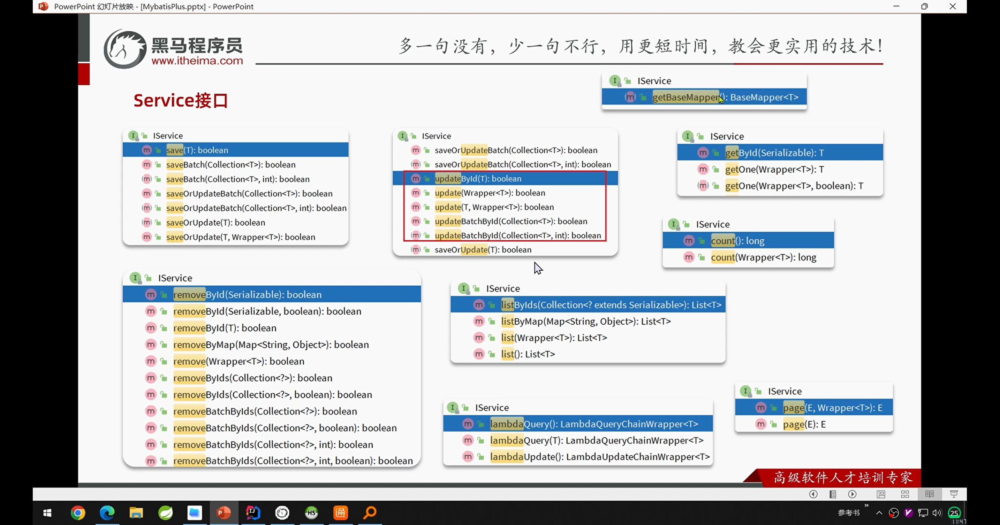

**问题：**

mapper里面是不需要写实现类的，这是因为mybatis对mapper进行了动态代理，帮助你实现了实现类

但是service中是没有动态代理的，那怎么办呢？

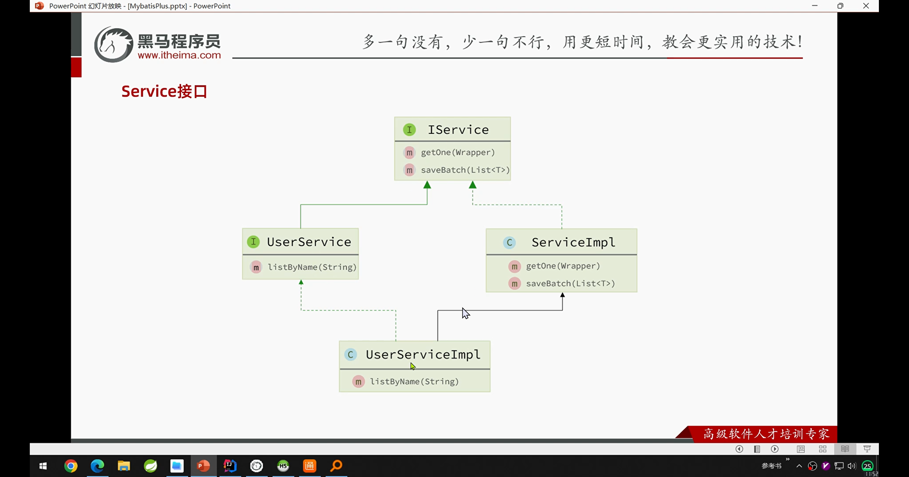

使用UserService继承IService然后得到了所有的方法，但是即便是得到了所有的方法后，UserServiceImpl依然要实现IService中的方法，那么怎么办呢？

mybatisplus帮我们实现了ServiceImpl，而ServiceImpl实现了IService，所以让UserService(自定义service)继承IService，而让UserServiceImlp(自定义实现类)继承ServiceImlp

```java
//IUserService 继承 IService<User>
public interface IUserService extends IService<User> {
}


//UserServiceImpl实现IUserService，并且继承ServiceImpl<UserMapper, User>
//选中UserServiceImpl Alt + insert 可以生成test
@Service
public class UserServiceImpl extends ServiceImpl<UserMapper, User> implements IUserService {
}

```

案例：IService 批量新增

需求：批量插入10万条用户数据，并做出对比：

普通for循环插入

IService的批量插入

```java
//前者117709ms
//后者31338ms
//打开重写批处理耗时（可以看到更快了）：4908ms


 @Test
    void testSaveOneByOne() {
        long b = System.currentTimeMillis();
        for (int i = 1; i <= 100000; i++) {
            userService.save(buildUser(i));
        }
        long e = System.currentTimeMillis();
        System.out.println("耗时：" + (e - b));
    }

    @Test
    void testSaveBatch() {
        // 准备10万条数据
        //把10万条数据全部扔到内存里容易把内存撑爆，所以每次存内存1000条数据，并将其batch插入
        List<User> list = new ArrayList<>(1000);
        long b = System.currentTimeMillis();
        for (int i = 1; i <= 100000; i++) {
            list.add(buildUser(i));
            // 每1000条批量插入一次
            if (i % 1000 == 0) {
                userService.saveBatch(list);
                list.clear();
            }
        }
        long e = System.currentTimeMillis();
        System.out.println("耗时：" + (e - b));
    }

    private User buildUser(int i) {
        User user = new User();
        user.setUsername("user_" + i);
        user.setPassword("123");
        user.setPhone("" + (18688190000L + i));
        user.setBalance(2000);
        user.setInfo("{\"age\": 24, \"intro\": \"英文老师\", \"gender\": \"female\"}");
        user.setCreateTime(LocalDateTime.now());
        user.setUpdateTime(user.getCreateTime());
        return user;
    }
    
    
清理的sql语句：
delete from user where user.username like 'user_%'
```

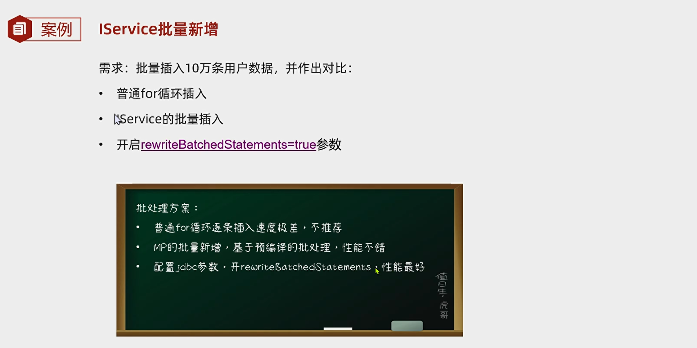

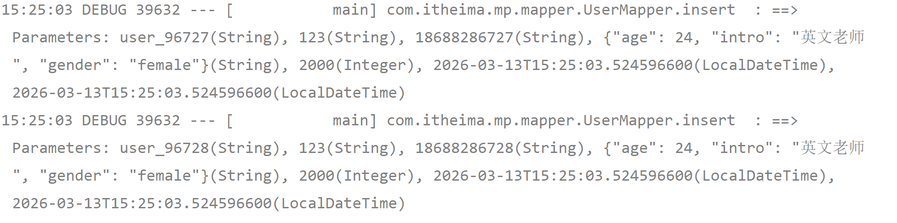

不开启rewriteBatchedStatements参数的的时候，mybatisoplus的IService使用的是预编译的形式，相比于传统的直接插入采用的事预编译的形式，然后不断的往里面刷参数的形式

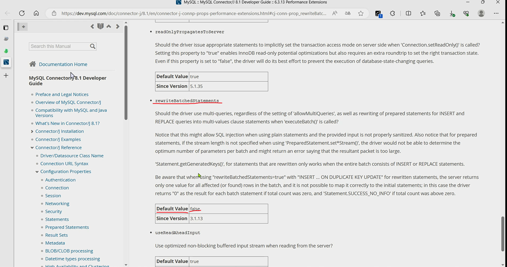

```java
jdbc:mysql://localhost:3306/itheima_mp_demo?useUnicode=true&characterEncoding=UTF-8&autoReconnect=true&serverTimezone=Asia/Shanghai&rewriteBatchedStatements=true
```

rewriteBatchedStatements=true

mybatisplus的批处理默认是使用一条一条的插入的(预编译之后，一条条得往里面刷)，而不是一批的那样的插入，后者效率更高，mybatisplus要达到后者需要添加rewriteBatchedStatements=true

lambda动态查询功能

**案例：IService的特殊的方法lambda**

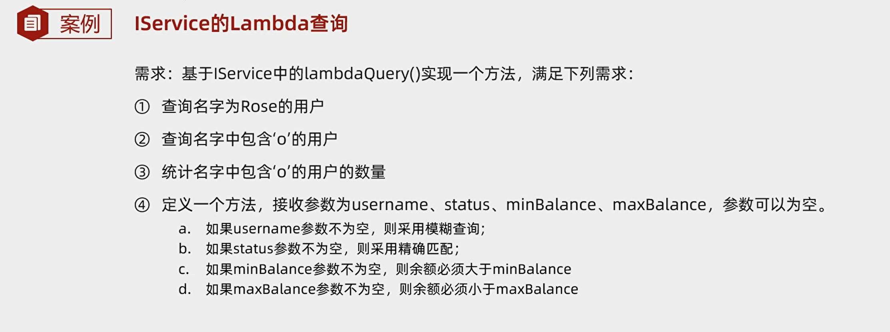

```java
  /**
     * 需求：基于IService中的lambdaQuery()实现一个方法，满足下列需求：
     * ① 查询名字为Rose的用户
     * ② 查询名字中包含‘o’的用户
     * ③ 统计名字中包含‘o’的用户的数量
     * ④ 定义一个方法，接收参数为username、status、minBalance、maxBalance，参数可以为空。
     *     　a. 如果username参数不为空，则采用模糊查询；
     *     　b. 如果status参数不为空，则采用精确匹配；
     *     　c. 如果minBalance参数不为空，则余额必须大于minBalance
     *     　d. 如果maxBalance参数不为空，则余额必须小于maxBalance
     */


    public List<User> queryUsers(String username, Integer status, Long minBalance, Long maxBalance) {
        return userService.lambdaQuery()
                .like(username != null, User::getUsername, username)
                .eq(status !=null, User::getStatus, status)
                .gt(minBalance != null, User::getBalance, minBalance)
                .lt(maxBalance != null, User::getBalance, maxBalance)
                .list();

    }
    @Test
    void testQueryLamabda0(){
        User user = userService.lambdaQuery().eq(User::getUsername, "Rose")
                .one();
        System.out.println("user = " + user);


        List<User> list = userService.lambdaQuery().like(User::getUsername, "o").list();
        list.forEach(System.out::println);

        Long count = userService.lambdaQuery().like(User::getUsername, "o").count();
        System.out.println("count = " + count);
    }

    @Test
    void testQueryLamabda1(){
        List<User> list = queryUsers("o", 1, null, null);
        list.forEach(System.out::println);
    }
     

```

**lambda动态更新方法**

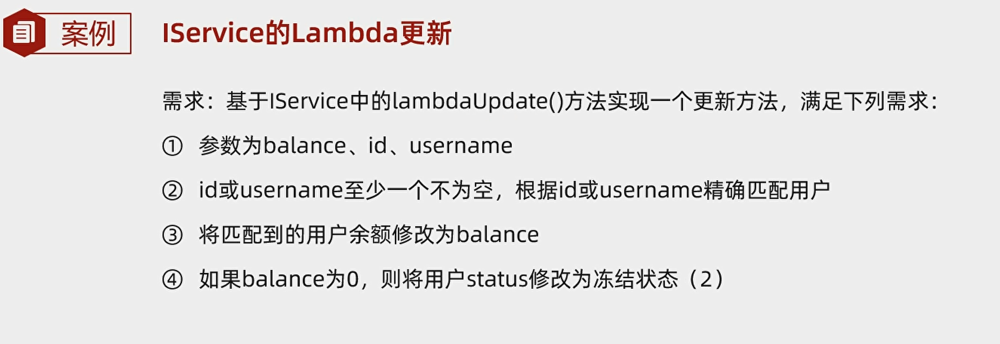

```java

    /**
     * 需求：基于IService中的lambdaUpdate()方法实现一个更新方法，满足下列需求：
     *     ① 参数为balance、id、username
     *     ② id或username至少一个不为空，根据id或username精确匹配用户
     *     ③ 将匹配到的用户余额修改为balance
     *     ④ 如果balance为0，则将用户status修改为冻结状态（2）
     */
    @Test
    void testQueryLamabda2(){
        updateBalance(0L, 1L, null);
    }

    private void updateBalance(Long balance, Long id, String username){
        /*
        * update user set balance = ？，status = 2 WHERE id = ?  AND  username = ？
        * */
        if (id == null && username == null){
            throw new RuntimeException("更新条件不能为空");
        }
        userService.lambdaUpdate()
                .set(User::getBalance, balance)
                .set(balance == 0, User::getStatus, 2)
                .eq(id != null, User::getId, id)
                .eq(username != null, User::getUsername, username)
                .update();
    }
```

**问题：当在userservice中调用addressservice的时候、在addressservice中调用userservice的时候，出现相互调用的情况**

spring无法解决复杂的循环依赖

1 种方法是调用mapper，利用mapper来实现

比如说一个service需要调用另外一个service，那么你最好不要调用。那怎么办？

注入的时候注入mapper

2 **静态工具**

第二种手段就是使用静态工具

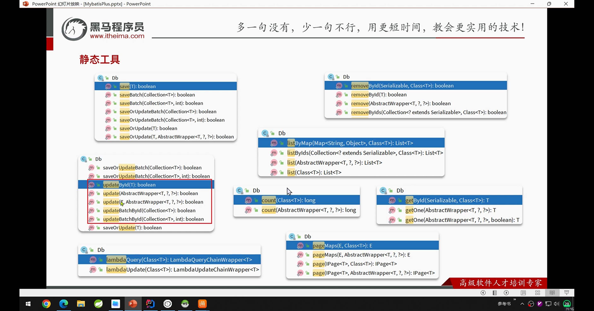

mybatisPlus的静态工具

其实就是在原来lambda的基础上多了一个Class的获取

```java
package com.itheima.mp.service.impl;

import com.baomidou.mybatisplus.core.conditions.query.QueryWrapper;
import com.baomidou.mybatisplus.extension.toolkit.Db;
import com.itheima.mp.domain.po.User;
import com.itheima.mp.service.IUserService;
import org.junit.jupiter.api.Test;
import org.springframework.beans.factory.annotation.Autowired;
import org.springframework.boot.test.context.SpringBootTest;

import java.time.LocalDateTime;
import java.util.ArrayList;
import java.util.List;

import static org.junit.jupiter.api.Assertions.*;


@SpringBootTest
class DBTest {


    @Test
    void testSaveUser(){
        User user = new User();
        user.setUsername("小马5");
        user.setPassword("123");
        user.setPhone("18688990011");
        user.setBalance(20000);
        user.setInfo("{\"age\": 24, \"intro\": \"英文老师\", \"gender\": \"female\"}");
        user.setCreateTime(LocalDateTime.now());
        user.setUpdateTime(LocalDateTime.now());

        Db.save(user);
    }

    @Test
    void testSelectUser(){
        List<User> list = Db.list(new QueryWrapper<>(new User()).like("username", "o"));
        list.forEach(System.out::println);
    }

    @Test
    void testSaveOneByOne() {
        long b = System.currentTimeMillis();
        for (int i = 1; i <= 100000; i++) {
            Db.save(buildUser(i));
        }
        long e = System.currentTimeMillis();
        System.out.println("耗时：" + (e - b));
    }

    @Test
    void testSaveBatch() {
        // 准备10万条数据
        List<User> list = new ArrayList<>(1000);
        long b = System.currentTimeMillis();
        for (int i = 1; i <= 100000; i++) {
            list.add(buildUser(i));
            // 每1000条批量插入一次
            if (i % 1000 == 0) {
                Db.saveBatch(list);
                list.clear();
            }
        }
        long e = System.currentTimeMillis();
        System.out.println("耗时：" + (e - b));
    }

    private User buildUser(int i) {
        User user = new User();
        user.setUsername("user_" + i);
        user.setPassword("123");
        user.setPhone("" + (18688190000L + i));
        user.setBalance(2000);
        user.setInfo("{\"age\": 24, \"intro\": \"英文老师\", \"gender\": \"female\"}");
        user.setCreateTime(LocalDateTime.now());
        user.setUpdateTime(user.getCreateTime());
        return user;
    }


    /**
     * 需求：基于IService中的lambdaQuery()实现一个方法，满足下列需求：
     * ① 查询名字为Rose的用户
     * ② 查询名字中包含‘o’的用户
     * ③ 统计名字中包含‘o’的用户的数量
     * ④ 定义一个方法，接收参数为username、status、minBalance、maxBalance，参数可以为空。
     *     　a. 如果username参数不为空，则采用模糊查询；
     *     　b. 如果status参数不为空，则采用精确匹配；
     *     　c. 如果minBalance参数不为空，则余额必须大于minBalance
     *     　d. 如果maxBalance参数不为空，则余额必须小于maxBalance
     */


    public List<User> queryUsers(String username, Integer status, Long minBalance, Long maxBalance) {
        return Db.lambdaQuery(User.class)
                .like(username != null, User::getUsername, username)
                .eq(status !=null, User::getStatus, status)
                .gt(minBalance != null, User::getBalance, minBalance)
                .lt(maxBalance != null, User::getBalance, maxBalance)
                .list();

    }
    @Test
    void testQueryLamabda0(){
        User user = Db.lambdaQuery(User.class).eq(User::getUsername, "Rose")
                .one();
        System.out.println("user = " + user);


        List<User> list = Db.lambdaQuery(User.class).like(User::getUsername, "o").list();
        list.forEach(System.out::println);

        Long count = Db.lambdaQuery(User.class).like(User::getUsername, "o").count();
        System.out.println("count = " + count);
    }

    @Test
    void testQueryLamabda1(){
        List<User> list = queryUsers("o", 1, null, null);
        list.forEach(System.out::println);
    }

    /**
     * 需求：基于IService中的lambdaUpdate()方法实现一个更新方法，满足下列需求：
     *     ① 参数为balance、id、username
     *     ② id或username至少一个不为空，根据id或username精确匹配用户
     *     ③ 将匹配到的用户余额修改为balance
     *     ④ 如果balance为0，则将用户status修改为冻结状态（2）
     */
    @Test
    void testQueryLamabda2(){
        updateBalance(0L, 1L, null);
    }

    private void updateBalance(Long balance, Long id, String username){
        /*
         * update user set balance = ？，status = 2 WHERE id = ?  AND  username = ？
         * */
        if (id == null && username == null){
            throw new RuntimeException("更新条件不能为空");
        }
       Db.lambdaUpdate(User.class)
                .set(User::getBalance, balance)
                .set(balance == 0, User::getStatus, 2)
                .eq(id != null, User::getId, id)
                .eq(username != null, User::getUsername, username)
                .update();
    }


}

```

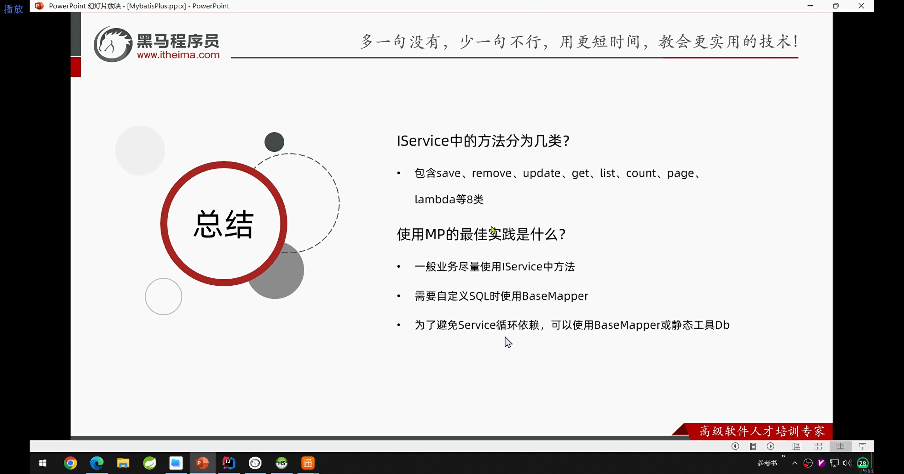

```java
public interface IUserService extends IService<User> {
    List<User> queryUsers(String username, Integer status, Long minBalance, Long maxBalance);
}

@Service
public class UserServiceImpl extends ServiceImpl<UserMapper, User> implements IUserService {

    @Override
    public List<User> queryUsers(String username, Integer status, Long minBalance, Long maxBalance) {
//        Db.lambdaQuery(Address.class).list();
//        getBaseMapper().updateBalanceByWrapper();
        return lambdaQuery().like(User::getUsername, "o").list();
    }
}

/**
*    当在UserService中调佣AddressService中的东西的时候（不是自己的），使用的是Db.lambdaQuery(Address.class).list();
*    而如果UserService调用的是自己呢，那么直接使用lambdaQuery().like(User::getUsername, "o").list();即可
*    如果自己是UserService，那么如何获取自己的mapper呢（在mybatisplus的条件下）？
    需要注入吗？
    不需要！通过 getBaseMapper()即可获取UserService对应的UserMapper
    通过 getBaseMapper().updateBalanceByWrapper();即可调用UserService中的mapper中的专门的特定函数
**/
```

拓展功能

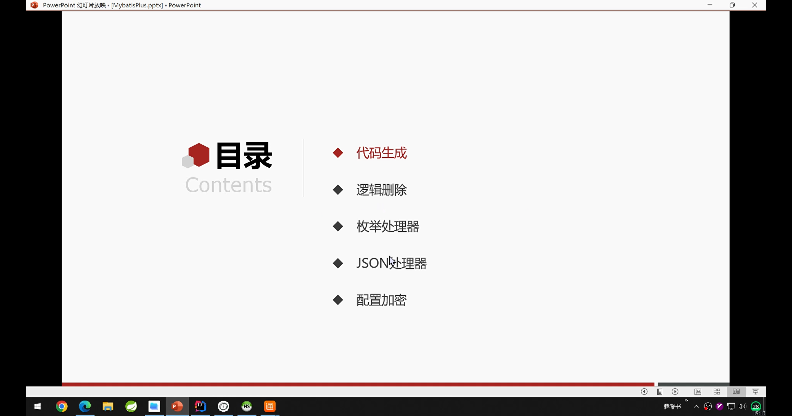

代码生成：