代码生成

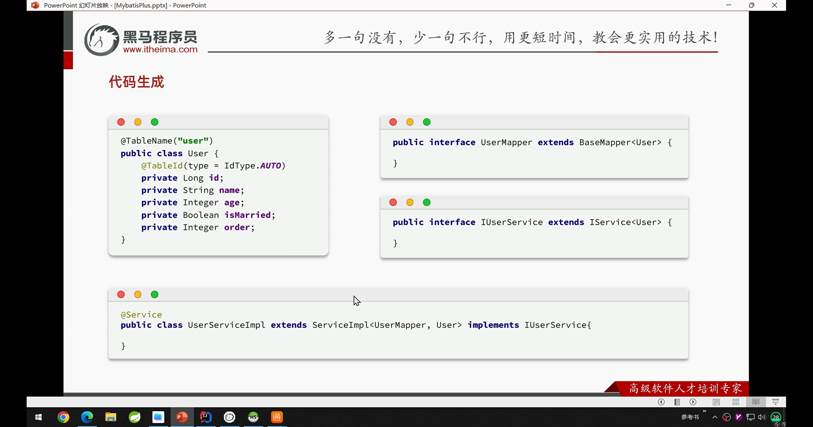

一般来说我们使用myabtisplus的时候，

1. 先写实体类

1. 然后写mapper，然后mapper继承

1. 然后写接口service，service也要继承

1. 然后接口的实现类serviceimpl要继承并且实现service的接口

mybatisplus的插件-代码生成器

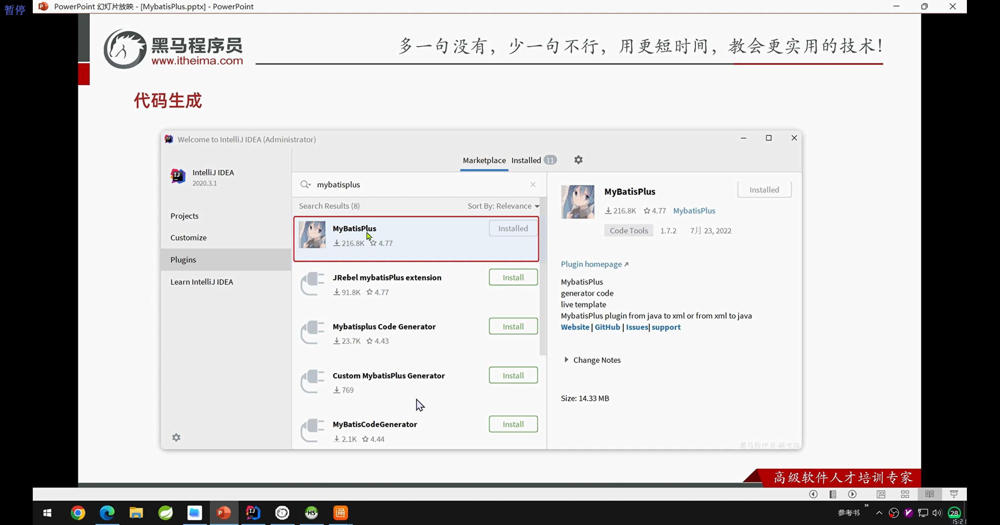

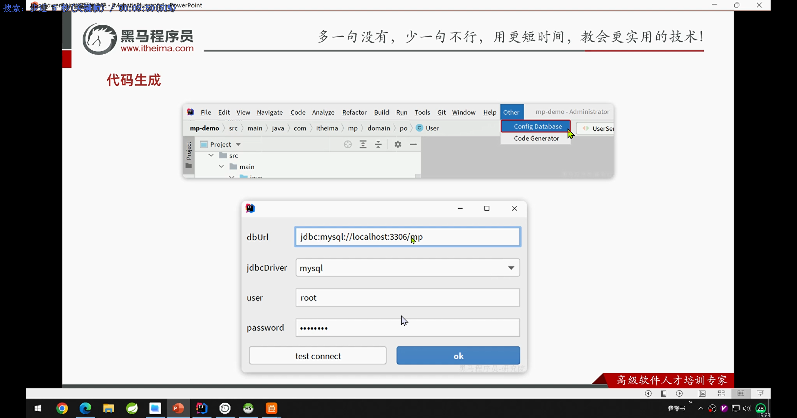

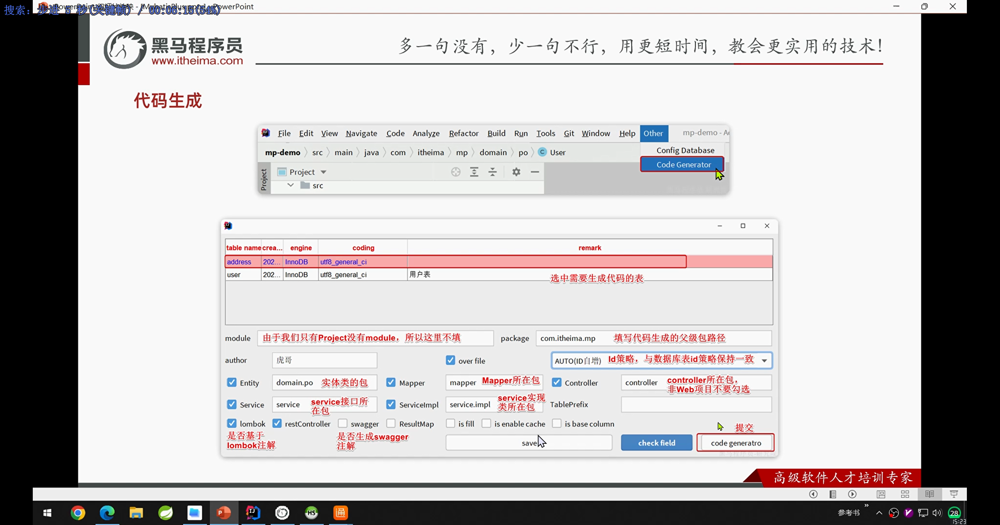

自动生成service和impl的框架代码

**mybatisplus的逻辑删除**

很多数据并不能直接删除，但是需要进行逻辑删除

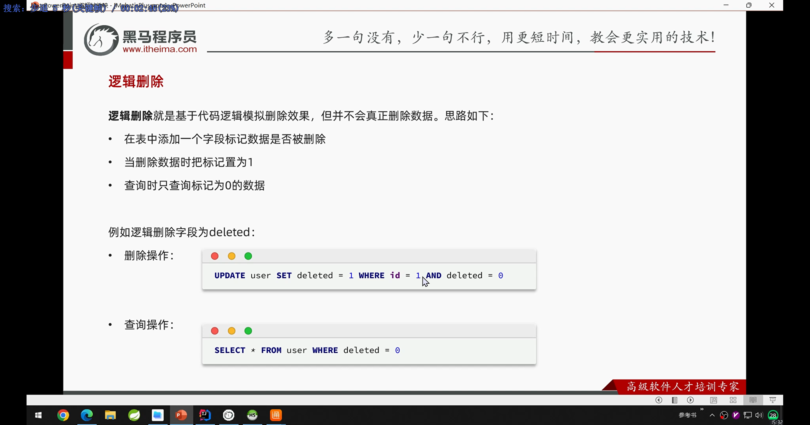

删除的时候，对于代码而言并没有变成，而在底层的SQL，由原来的删除语句，自动变成了逻辑删除语句

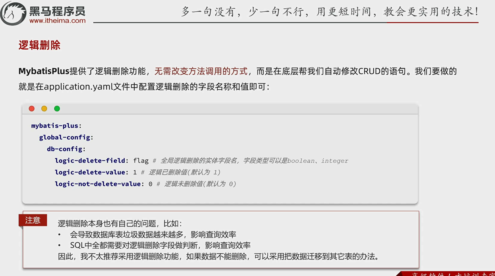

```yaml
mybatis-plus:
    global-config:
        db-config:
            logic-delete-field: flag # 全局逻辑删除的实体字段名，字段类型可以是boolean、integer
            logic-delete-value: 1 # 逻辑已删除值(默认为 1)
            logic-not-delete-value: 0 # 逻辑未删除值(默认为 0)
```

逻辑删除本身也有自己的问题，比如

会导致数据库表垃圾数据越来越多，影响查询效率

SQL中全都需要对逻辑删除字段做判断，影响查询效率

因此，不太推荐采用逻辑删除功能，如果数据不能删除，可以采用把数据迁移到其他表中的方法

枚举处理器

问题：每一次想要得到状态都要去查一下

解决办法：

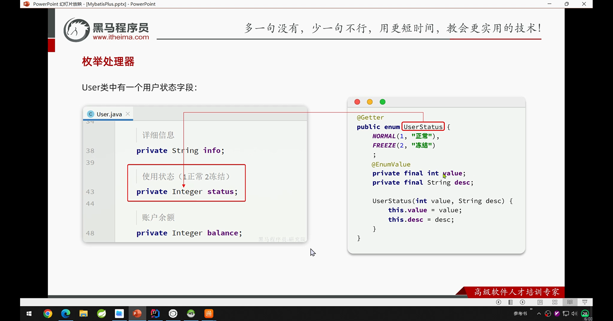

开发的时候，每次对状态更该的逻辑都需要明确不同状态的含义，但仅仅是1或0就不知道其含义。还需要去查数据库表的结构，这样就不太好

那么把枚举类型晒给它吗？这样太麻烦了

最好的办法是用UserStatus直接替代Integer，这样直接复制NOMALL或FREEZE即可

那么我需要自己去定义这样的类型处理器吗？

并不需要，mybatisplus给我定义好了

分两步：

第一步，在UserStatus中添加@EnumValue，做一个数据库的映射

第二步，就是在yaml全局配置文件中添加全局枚举处理器

```yaml
mybatis-plus:
    configuration:
        default-enum-type-handler: com.baomidou.mybatisplus.core.handlers.MybatisEnumTypeHandler
```

因为这个UserStatus，然后是枚举类，然后是私有类

注意，别忘了添加@EnumValue

```java
@Getter
public enum UserStauts {
    NORMAL(1, "正常"),
    FREZZE(2, "冻结"),
    ;
    @EnumValue
    private final int value;
    private final String desc;

    UserStauts(int value, String desc) {
        this.value = value;
        this.desc = desc;
    }
}
```

测试

```java
  //枚举测试
    @Test
    void testEnumSaveUser() {
        User user = new User();
        user.setUsername("any");
        user.setPassword("123");
        user.setPhone("18688990011");
        user.setBalance(200);
        user.setInfo("{\"age\": 24, \"intro\": \"英文老师\", \"gender\": \"female\"}");
        user.setStatus(UserStauts.NORMAL);
        user.setCreateTime(LocalDateTime.now());
        user.setUpdateTime(LocalDateTime.now());
        userService.save(user);

        User result = userService.getOne(new QueryWrapper<>(new User()).eq("username", "any"));
        System.out.println(result);
    }
    
     @Test
    void testEnumsGetOneById(){
        User user = userService.getById(1L);
        System.out.println(user);
    }
```

注意：user表中的info竟然是JSON信息

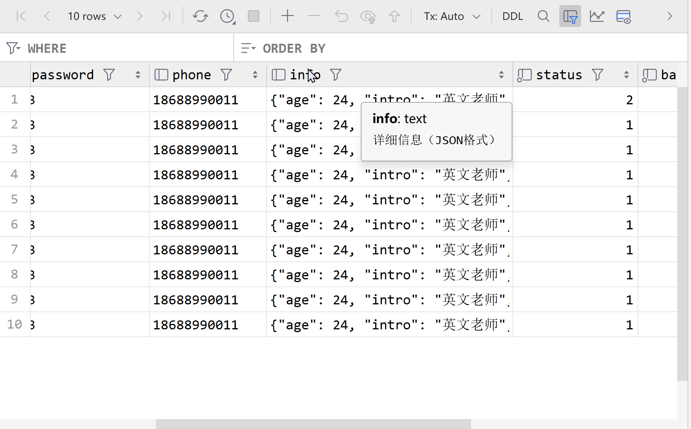

在MySQL5.7加入了一个新的数据类型也就是JSON类型

如果mysql中的数据为json格式，那么转化为String类型还需要通过转化，这个有点麻烦

那么最好的办法是设置一个UserInfo然后与Info对应之后，直接把数据库中的Json类型的info取出来和UserInfo对应起来

但是怎么做呢？

mybatisplus其中的有这个的处理器

只需要在UserInfo中的字段上加上一个注解即可

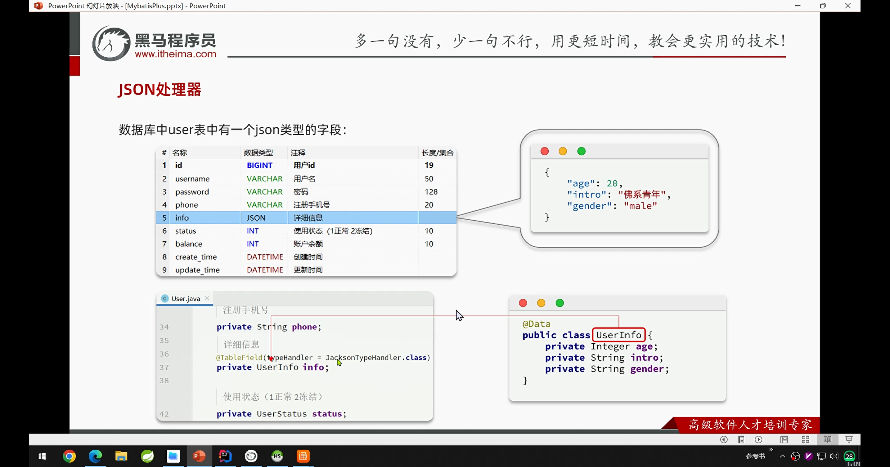

一共三步

第一、二、三步

写一个UserInfo的类；

并且修改User类中的info的类型为UserInfo；

然后在User类上添加autoResultMap = true;

```java
package com.itheima.mp.domain.po;

import lombok.AllArgsConstructor;
import lombok.Data;
import lombok.NoArgsConstructor;

@Data
@AllArgsConstructor(staticName = "of")
@NoArgsConstructor
public class UserInfo {
    private Integer age;
    private String intro;
    private String gender;
}


//添加这个
@TableName(value = "user", autoResultMap = true)
public class User {
```

第三步是添加jackon-core的依赖

```xml
 <dependency>
            <groupId>com.fasterxml.jackson.core</groupId>
            <artifactId>jackson-databind</artifactId>
            <!-- 版本号通常由 spring-boot-dependencies 管理，如果不指定版本报错，可以尝试显式指定一个稳定版本，如 2.15.2 -->
            <!-- <version>2.15.2</version> -->
        </dependency>
        
分不清的话就引入
<dependency>
            <groupId>org.springframework.boot</groupId>
            <artifactId>spring-boot-starter-json</artifactId>
        </dependency>
```

最后是测试

```java
  @Test
    void testNewSaveUser(){
        User user = new User();
        user.setUsername("小马6");
        user.setPassword("123");
        user.setPhone("18688990011");
        user.setBalance(20000);
        UserInfo userInfo = UserInfo.of(24, "英文老师", "female");
        //user.setInfo("{\"age\": 24, \"intro\": \"英文老师\", \"gender\": \"female\"}");
        user.setInfo(userInfo);
        user.setCreateTime(LocalDateTime.now());
        user.setUpdateTime(LocalDateTime.now());

        userService.save(user);

        User one = userService.getOne(new QueryWrapper<User>().like("username", "小马6"));
        System.out.println(one);
    }
```

这样就完成了json到java中类的转化

**配置加密**

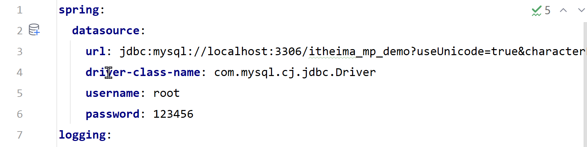

目前数据库是明文的，但是在公司的开发中，人员流动比较大，家贼难防。因此mybatisplus提供了一种加密方式

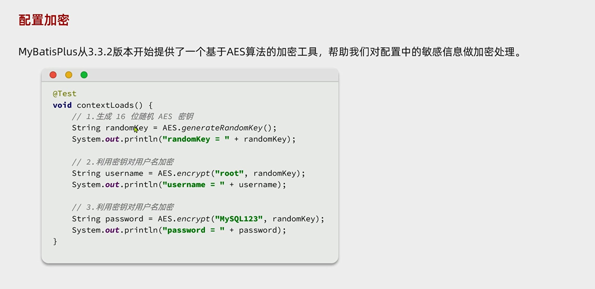

用AES中的静态方法生成一个秘钥，这个秘钥你不能告诉任何人

然后用这个秘钥，对所有的数据加密

```java
class MpDemoApplicationTests {

     @Test
    void contextLoads() {
        // 生成 16 位随机 AES 密钥
        String randomKey = AES.generateRandomKey();
        System.out.println("randomKey = " + randomKey);

        // 利用密钥对用户名加密
        String username = AES.encrypt("root", randomKey);
        System.out.println("username = " + username);

        // 利用密钥对用户名加密
        String password = AES.encrypt("123456", randomKey);
        System.out.println("password = " + password);
    }
    
randomKey = abbda82f165fd0bf
username = iQmvPGc+9zQB23p2LXBG1w==
password = EeEw+/aHEmUDYJ6/cDJyAg==
```

mpw：加密生成的内容

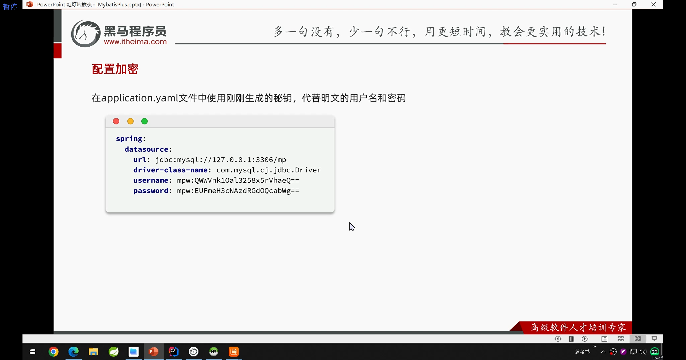

```yaml
spring:
  datasource:
    url: jdbc:mysql://127.0.0.1:3306/mp
    driver-class-name: com.mysql.cj.jdbc.Driver
    username: mpw:QWVnk10al3258x5rVhaeQ==
    password: mpw:EUFmeH3cNAzdRGdOQcabWg==
```

那springboot怎么对你加的秘钥进行解密呢？

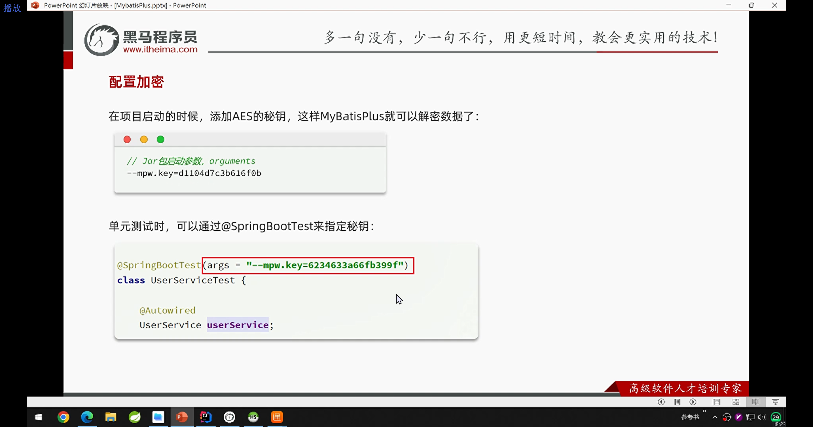

```java

```

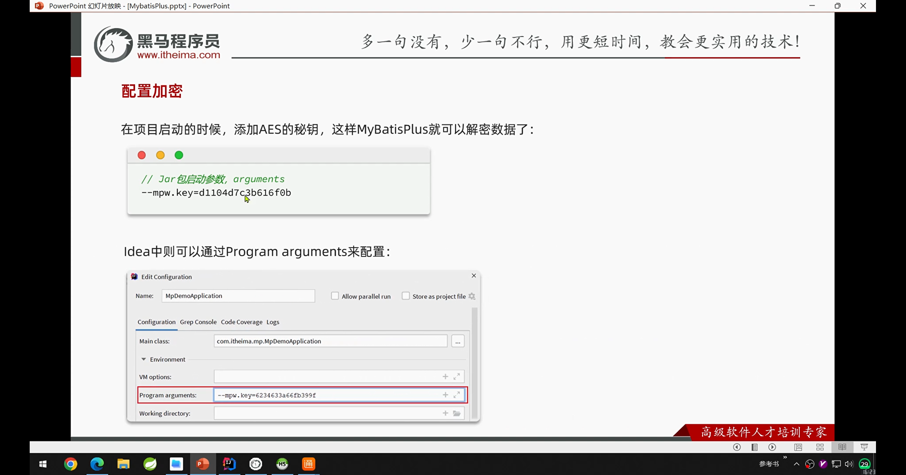

插件功能

注意：myabtisplus的插件都是基于mybatis的拦截器来实现的

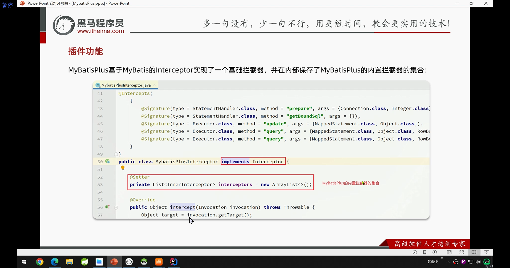

mybati的拦截器：

myabtis允许我们在CRUD改查语句执行的任意阶段，去拦截并且执行你自己的业务逻辑。

就是myabtis帮我们执行一个CRUD的方法，一般要先准备操作语句，然后准备参数，然后就执行，执行完然后返回处理结果。在这个阶段过程中，它允许你去拦截并且执行你自己的业务逻辑

分页插件，pageHelper其实就是基于拦截器，那你的SQL语句给拦住，就是在执行之前给拦下来。然后再后面拼上limit，所以实现了分页。

mybatisplus就基于mybati的拦截器，实现了一个通用的基础拦截器，名称为MyabtisPlusInterceptor

它实现的事myabtis的interceptor，并且在prepare阶段、update、query等等都进行了拦截。

拦截下来，你会发现，它的内部有一个成语变量叫interceptors，也就是mybatisplus的内置拦截器，要执行的逻辑在InnerInterceptor中写就ok了

不用再写复杂的拦截过程，只需要写拦截逻辑即可

拦截逻辑mybatisplus也提供好了

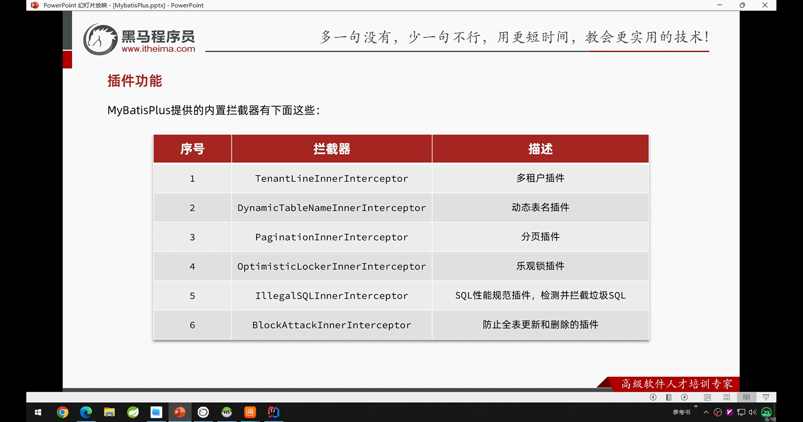

多租户、动态表名、乐观锁都会采用业务手段去解决。也用的比较少

由于已经用了mybatisplus，那么里面有了page的插件，就不需要再另外引入page分页的插件了

怎么去用？

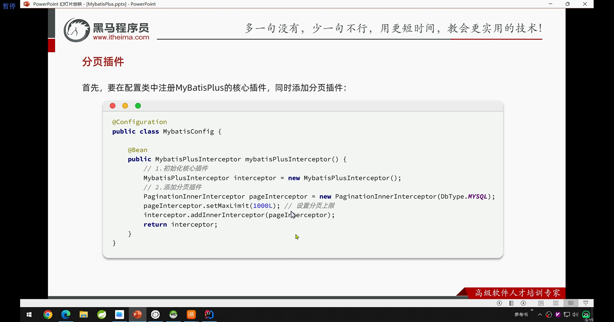

```java
package com.itheima.mp.config;

import com.baomidou.mybatisplus.annotation.DbType;
import com.baomidou.mybatisplus.extension.plugins.MybatisPlusInterceptor;
import com.baomidou.mybatisplus.extension.plugins.inner.PaginationInnerInterceptor;
import org.springframework.context.annotation.Bean;
import org.springframework.context.annotation.Configuration;

@Configuration
public class MybatisConfig {

    @Bean
    public MybatisPlusInterceptor mybatisPlusInterceptor(){
        // 1.创建核心拦截器
        MybatisPlusInterceptor interceptor = new MybatisPlusInterceptor();
        // 2.创建插件
        PaginationInnerInterceptor paginationInnerInterceptor = new PaginationInnerInterceptor(DbType.MYSQL);
        paginationInnerInterceptor.setMaxLimit(1000L);
        interceptor.addInnerInterceptor(paginationInnerInterceptor);
        // 返回
        return interceptor;
    }
}

```

然后使用分页插件

IService中就有分页插件，然后使用即可

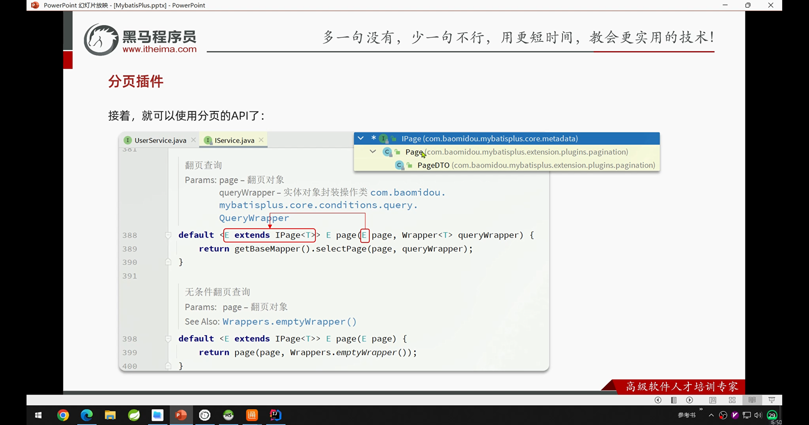

其中，E作为一个类型继承了IPage，而IPage类又继承了Page和PageDTO。比较常用的Page

那如何用Page呢？

分页的时候传入的E，返回的也是E。

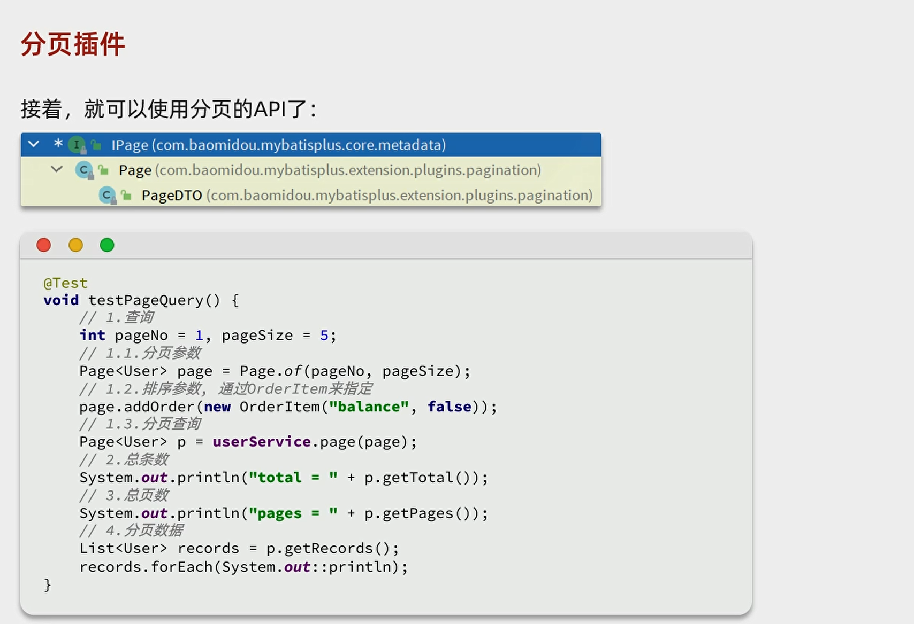

分页查询

记住，一定首先要进行config的配置mybatisplusinterceptor拦截器（不要忘记）

```java
//分页插件

@Configuration
public class MybatisConfig {

    @Bean
    public MybatisPlusInterceptor mybatisPlusInterceptor(){
        // 1.创建核心拦截器
        MybatisPlusInterceptor interceptor = new MybatisPlusInterceptor();
        // 2.创建插件
        PaginationInnerInterceptor paginationInnerInterceptor = new PaginationInnerInterceptor(DbType.MYSQL);
        paginationInnerInterceptor.setMaxLimit(1000L);
        interceptor.addInnerInterceptor(paginationInnerInterceptor);
        // 返回
        return interceptor;
    }
}
```

```java
@Test
void testPageQuery() {
    // 1.查询
    int pageNo = 1, pageSize = 5;
    // 1.1.分页参数
    Page<User> page = Page.of(pageNo, pageSize);
    // 1.2.排序参数，通过OrderItem来指定
    page.addOrder(new OrderItem("balance", false));
    // 1.3.分页查询
    Page<User> p = userService.page(page);
    // 2.总条数
    System.out.println("total = " + p.getTotal());
    // 3.总页数
    System.out.println("pages = " + p.getPages());
    // 4.分页数据
    List<User> records = p.getRecords();
    records.forEach(System.out::println);
}
```

```java
@Test
void testPageQuery() {
    int pageNo = 1, pageSize = 5;
    // 1.分页条件
    Page<User> p = Page.of(pageNo, pageSize);
    // 2.排序条件
    p.addOrder(new OrderItem("balance", false));

    // 3.查询
    Page<User> page = userService.page(p);

    // 4.分页结果
    long total = page.getTotal();
    System.out.println("total = " + total);
    long pages = page.getPages();
    System.out.println("pages = " + pages);
    List<User> records = page.getRecords();
    for (User record : records) {
        System.out.println("record = " + record);
    }
}


```

条件分页查询

```java
 @Test
    void testPageQuery2(){
        int pageNo = 1, pageSize = 5;
        Page<User> page = Page.of(pageNo, pageSize);
        page.addOrder(new OrderItem("balance", false));

        //添加查询条件
        QueryWrapper<User> wrapper = new QueryWrapper<>(new User())
                .like("username", "o");

        //条件分页查询
        Page<User> p = userService.page(page, wrapper);
        System.out.println("total = " + p.getTotal());
        System.out.println("pages = " + p.getPages());
        System.out.println("条件查询结果");
        List<User> records = p.getRecords();
        records.forEach(System.out::println);

    }
```

**分页案例**

需求如下：

编写一个UserController的接口，实现User的分页查询

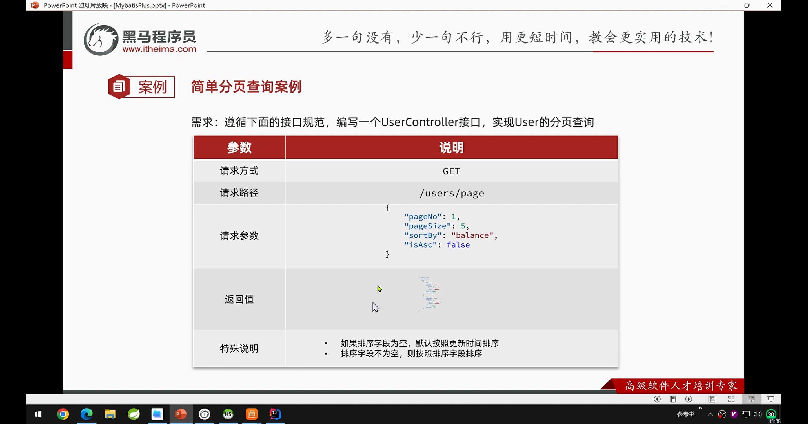

返回值说明

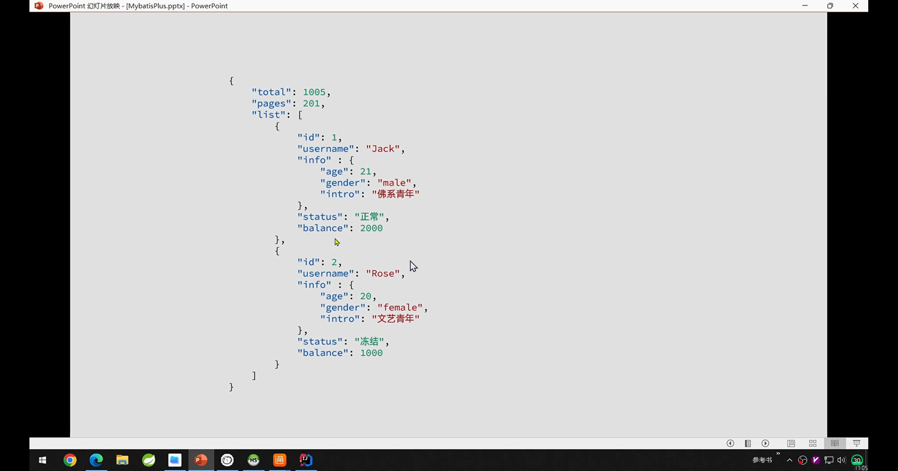

步骤如下

1. 请求参数实体

1. 返回list中的实体

1. 分页结果实体

1. controller层

1. service层

请求参数实体

```java
@Data
public class PageQuery {
    private Integer pageNo = 1;
    private Integer pageSize = 5;
    private String sortBy;
    private Boolean isAsc = false;
}

```

返回list中的实体

```java
@Data
public class UserVO {
    private Long id;
    private String username;
    private UserInfo info;
    private UserStauts status;
    private Integer balance;
}
```

分页结果实体

```java
@Data
@AllArgsConstructor(staticName = "of")
public class PageVO<T> {
   private Long total;
   private Long pages;
   private List<T> list;
}

```

controller层

```java
@RestController
@RequestMapping("users")
@AllArgsConstructor
public class UserController {

    private final IUserService userService;
    private final IAddressService addressService;

    @GetMapping("/pages")
    public PageVO<UserVO> queryUserByPage(PageQuery query) {
        return userService.queryUserByPage(query);
    }
}

```

service层

```java

    @Override
    public PageVO<UserVO> queryUserByPage(PageQuery query) {
        //1.分页条件
        Page<User> p = Page.of(query.getPageNo(), query.getPageSize());
        //2.排序条件
        if (!StrUtil.isNotBlank(query.getSortBy())){
            p.addOrder(new OrderItem(query.getSortBy(), query.getIsAsc()));
        }else{
            p.addOrder(new OrderItem("update_ime", query.getIsAsc()));
        }
        //3.查询
        //由于本身是在userservice中所以直接page即可
        page(p);
        //4.获取结构
        List<User> users = p.getRecords();
        if (CollUtil.isEmpty(users)){
            //没有数据，直接返回
            return PageVO.of(p.getTotal(), p.getPages(), Collections.emptyList());
        }else{
            //4.2 把user转化为VO  集合之间的拷贝使用的BeanUtil
            List<UserVO> userVOList = BeanUtil.copyToList(users, UserVO.class);
            //4.3 封装返回
            return PageVO.of(p.getTotal(), p.getPages(), userVOList);
        }
    }
```

别忘了引入springboot-starter

```xml
  <dependency>
            <groupId>org.springframework.boot</groupId>
            <artifactId>spring-boot-starter-web</artifactId>
        </dependency>
```

其中使用的hutool工具包的依赖

注意是**hutool-all**

```xml
<dependency>
            <groupId>cn.hutool</groupId>
            <artifactId>hutool-all</artifactId>
            <version>5.8.11</version>
        </dependency>
```

**通用分页实体**

**需求：**

- 在 PageQuery 中定义方法，将 PageQuery 对象转为 MyBatisPlus 中的 Page 对象

- 在 PageDTO 中定义方法，将 MyBatisPlus 中的 Page 结果转为 PageDTO 结果

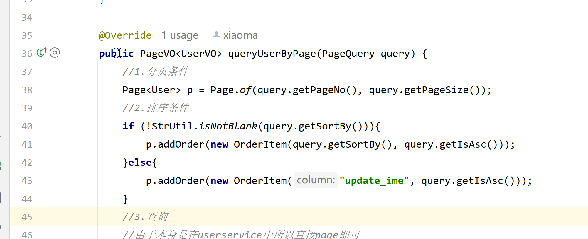

由于queryVO是固定的，而且Page分页的很多操作都是固定的，所以可以进行一个抽取

一般像什么都不写只有单单的变量的话称为贫血模型

```java
package com.itheima.mp.domain.query;

import cn.hutool.core.util.StrUtil;
import com.baomidou.mybatisplus.core.metadata.OrderItem;
import com.baomidou.mybatisplus.extension.plugins.pagination.Page;
import lombok.Data;

// 贫血模型 、 充血模型
@Data
public class PageQuery {
    private Integer pageNo = 1;
    private Integer pageSize = 5;
    private String sortBy;
    private Boolean isAsc = false;

    // 把当前query构造成MyBatisPlus的 Page
    public <T> Page<T> toMpPage(String defaultSortBy, boolean isAsc){
        // 1.分页条件
        Page<T> p = Page.of(pageNo, pageSize);
        // 2.排序条件
        if(StrUtil.isNotBlank(sortBy)) {
            p.addOrder(new OrderItem(sortBy, isAsc));
        }else{
            p.addOrder(new OrderItem(defaultSortBy, isAsc));
        }
        return p;
    }

    // 把当前query构造成MyBatisPlus的 Page
    public <T> Page<T> toMpPage(OrderItem ... defaultOrderItems){
        // 1.分页条件
        Page<T> p = Page.of(pageNo, pageSize);
        // 2.排序条件
        if(StrUtil.isNotBlank(sortBy)) {
            p.addOrder(new OrderItem(sortBy, isAsc));
            return p;
        }
        // 3.默认排序
        for (OrderItem order : defaultOrderItems) {
            p.addOrder(order);
        }
        return p;
    }

    // 把当前query构造成MyBatisPlus的 Page
    public <T> Page<T> toMpPageDefaultSortByUpdate(){
        // 1.分页条件
        Page<T> p = Page.of(pageNo, pageSize);
        // 2.排序条件
        if(StrUtil.isNotBlank(sortBy)) {
            p.addOrder(new OrderItem(sortBy, isAsc));
        }else{
            p.addOrder(new OrderItem("update_time", false));
        }
        return p;
    }
}

```

这是第一步，也是分页条件的公共抽取

下面是第二步，也是对查询结果的公共抽取

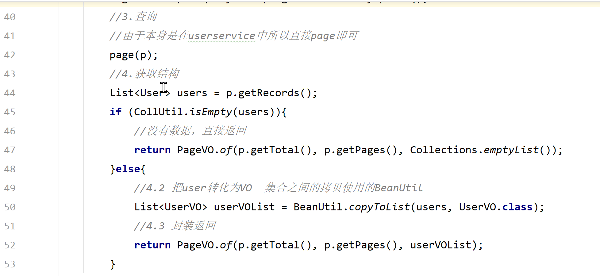

对结果的处理都是一样的，也是可以进行处理的。

因为基本上就是判空、然后集合转换、然后封装返回

而它的作用基本上就是把Page转化为PageVO

```java
package com.itheima.mp.domain.vo;

import cn.hutool.core.bean.BeanUtil;
import cn.hutool.core.collection.CollUtil;
import com.baomidou.mybatisplus.extension.plugins.pagination.Page;
import lombok.AllArgsConstructor;
import lombok.Data;
import lombok.NoArgsConstructor;

import java.util.Collections;
import java.util.List;
import java.util.function.Function;
import java.util.stream.Collectors;

@Data
@AllArgsConstructor(staticName = "of")
@NoArgsConstructor
public class PageVO<T> {
    private Long total;
    private Long pages;
    private List<T> list;

    public <P> PageVO(Page<P> page, Class<T> clazz) {
        this.total = page.getTotal();
        this.pages = page.getPages();
        List<P> records = page.getRecords();
        if (CollUtil.isEmpty(records)) {
            list = Collections.emptyList();
            return;
        }
        this.list = BeanUtil.copyToList(records, clazz);
    }

    public <P> PageVO(Page<P> page, Function<P, T> convertor) {
        this.total = page.getTotal();
        this.pages = page.getPages();
        List<P> records = page.getRecords();
        if (CollUtil.isEmpty(records)) {
            list = Collections.emptyList();
            return;
        }
        this.list = records.stream().map(convertor).collect(Collectors.toList());
    }
}


```

```java
package com.itheima.mp.domain.vo;

import com.itheima.mp.domain.po.UserInfo;
import com.itheima.mp.enums.UserStatus;
import lombok.Data;

@Data
public class UserVO {
    private Long id;
    private String username;
    private UserInfo info;
    private UserStatus status;
    private Long balance;
}


@RestController
@RequestMapping("users")
@RequiredArgsConstructor
public class UserController {

    private final IUserService userService;

    @GetMapping("/page")
    public PageVO<UserVO> queryUserByPage(PageQuery query){
        return userService.queryUserByPage(query);
    }
}

```

添加final省去@autowire ，再添加@RequiredArgsConstructor

```java
@Getter
public enum UserStatus {
    NORMAL(1, "正常"),
    FREEZE(2, "冻结"),
    ;
    @EnumValue
    private final int value;
    @JsonValue
    private final String desc;

    UserStatus(int value, String desc) {
        this.value = value;
        this.desc = desc;
    }
}

----------------------------------------------------------------------------------------------

package com.itheima.mp.domain.po;

import com.baomidou.mybatisplus.annotation.TableField;
import com.baomidou.mybatisplus.annotation.TableId;
import com.baomidou.mybatisplus.annotation.TableName;
import com.baomidou.mybatisplus.extension.handlers.JacksonTypeHandler;
import com.itheima.mp.enums.UserStatus;
import lombok.Data;

import java.time.LocalDateTime;

@Data
@TableName(value = "user", autoResultMap = true)
public class User {

    /**
     * 用户id
     */
    @TableId
    private Long id;

    /**
     * 用户名
     */
    @TableField("`username`")
    private String username;

    /**
     * 密码
     */
    private String password;

    /**
     * 注册手机号
     */
    private String phone;

    /**
     * 详细信息
     */
    @TableField(typeHandler = JacksonTypeHandler.class)
    private UserInfo info;

    /**
     * 使用状态（1正常 2冻结）
     */
    private UserStatus status;

    /**
     * 账户余额
     */
    private Integer balance;

    /**
     * 创建时间
     */
    private LocalDateTime createTime;

    /**
     * 更新时间
     */
    private LocalDateTime updateTime;
}

```

这两个注解都是干什么的

其中 @EnumValue   ——告诉 MyBatis-Plus：在数据库存取时，使用该字段的值作为枚举的“持久化值”。

    	private final int value;

具体行为：当你把 UserStatus.NORMAL 存入数据库时，MyBatis-Plus 不会存 "NORMAL" 字符串，而是存 value 字段的值 —— 即 1。从数据库读取时，如果查到 status = 1，MyBatis-Plus 会自动将其映射为 UserStatus.NORMAL。

   

 @JsonValue	——告诉 Jackson：在将该枚举对象序列化为 JSON 时，不要输出枚举名（如 "NORMAL"），而是输出		     	                                     这个字段的值。

    private final String desc;

```java

@Override
public PageVO<UserVO> queryUserByPage(PageQuery query) {
    // 1.分页条件
    Page<User> p = query.toMpPageDefaultSortByUpdate();
    // 2.查询
    page(p);
    // 3.返回
    return new PageVO<>(p, user -> {
        UserVO vo = BeanUtil.copyProperties(user, UserVO.class);
        String username = vo.getUsername();
        vo.setUsername(username.substring(0, username.length()- 4) + "****");
        return vo;
    });
}
```

**Hutool 工具包** 的字符串判空方法。

```java
@Override
public PageVO<UserVO> queryUserByPage(PageQuery query) {
    //1.分页条件
    Page<User> p = Page.of(query.getPageNo(), query.getPageSize());
    //2.排序条件
    if (StrUtil.isNotBlank(query.getSortBy())) {
        p.addOrder(new OrderItem(query.getSortBy(), query.getIsAsc()));
    }else {
        p.addOrder(new OrderItem("update_time", false));
    }
    //3.查询
    page(p);
    //4.1获取结果
    List<User> users = p.getRecords();
    if (CollUtil.isEmpty(users)) {
        return PageVO.of(p.getTotal(), p.getPages(), Collections.emptyList());
    }
    //4.2转化为vo
    List<UserVO> vos = BeanUtil.copyToList(users, UserVO.class);

    //5.封装返回

    return  PageVO.of(p.getTotal(), p.getPages(), vos);
}
```

```java
package com.itheima.mp.domain.vo;

import cn.hutool.core.bean.BeanUtil;
import cn.hutool.core.collection.CollUtil;
import com.baomidou.mybatisplus.extension.plugins.pagination.Page;
import lombok.AllArgsConstructor;
import lombok.Data;
import lombok.NoArgsConstructor;

import java.util.Collections;
import java.util.List;
import java.util.function.Function;
import java.util.stream.Collectors;

@Data
@AllArgsConstructor(staticName = "of")
@NoArgsConstructor
public class PageVO<T> {
    private Long total;
    private Long pages;
    private List<T> list;

    public <P> PageVO(Page<P> page, Class<T> clazz) {
        this.total = page.getTotal();
        this.pages = page.getPages();
        List<P> records = page.getRecords();
        if (CollUtil.isEmpty(records)) {
            list = Collections.emptyList();
            return;
        }
        this.list = BeanUtil.copyToList(records, clazz);
    }

    public <P> PageVO(Page<P> page, Function<P, T> convertor) {
        this.total = page.getTotal();
        this.pages = page.getPages();
        List<P> records = page.getRecords();
        if (CollUtil.isEmpty(records)) {
            list = Collections.emptyList();
            return;
        }
        this.list = records.stream().map(convertor).collect(Collectors.toList());
    }
}

```

加了有参构造@AllArgsConstructor(staticName = "of")，就必须加无参构造@NoArgsConstructor，否则json序列化的时候会报错

通用分页实体

由于重复的太多，所有将分页写成通用的

```java
package com.itheima.mp.domain.query;

import cn.hutool.core.util.StrUtil;
import com.baomidou.mybatisplus.core.metadata.OrderItem;
import com.baomidou.mybatisplus.extension.plugins.pagination.Page;
import lombok.Data;

// 贫血模型 、 充血模型
@Data
public class PageQuery {
    private Integer pageNo = 1;
    private Integer pageSize = 5;
    private String sortBy;
    private Boolean isAsc = false;

    // 把当前query构造成MyBatisPlus的 Page
    public <T> Page<T> toMpPage(String defaultSortBy, boolean isAsc){
        // 1.分页条件
        Page<T> p = Page.of(pageNo, pageSize);
        // 2.排序条件
        if(StrUtil.isNotBlank(sortBy)) {
            p.addOrder(new OrderItem(sortBy, isAsc));
        }else{
            p.addOrder(new OrderItem(defaultSortBy, isAsc));
        }
        return p;
    }

    // 把当前query构造成MyBatisPlus的 Page
    public <T> Page<T> toMpPage(OrderItem ... defaultOrderItems){
        // 1.分页条件
        Page<T> p = Page.of(pageNo, pageSize);
        // 2.排序条件
        if(StrUtil.isNotBlank(sortBy)) {
            p.addOrder(new OrderItem(sortBy, isAsc));
            return p;
        }
        // 3.默认排序
        for (OrderItem order : defaultOrderItems) {
            p.addOrder(order);
        }
        return p;
    }

    // 把当前query构造成MyBatisPlus的 Page
    public <T> Page<T> toMpPageDefaultSortByUpdate(){
        // 1.分页条件
        Page<T> p = Page.of(pageNo, pageSize);
        // 2.排序条件
        if(StrUtil.isNotBlank(sortBy)) {
            p.addOrder(new OrderItem(sortBy, isAsc));
        }else{
            p.addOrder(new OrderItem("update_time", false));
        }
        return p;
    }
}

---------------------------------------------------------------------------------

import cn.hutool.core.bean.BeanUtil;
import cn.hutool.core.collection.CollUtil;
import com.baomidou.mybatisplus.extension.plugins.pagination.Page;
import lombok.AllArgsConstructor;
import lombok.Data;
import lombok.NoArgsConstructor;

import java.util.Collections;
import java.util.List;
import java.util.function.Function;
import java.util.stream.Collectors;

@Data
@AllArgsConstructor(staticName = "of")
@NoArgsConstructor
public class PageVO<T> {
    private Long total;
    private Long pages;
    private List<T> list;

    public <P> PageVO(Page<P> page, Class<T> clazz) {
        this.total = page.getTotal();
        this.pages = page.getPages();
        List<P> records = page.getRecords();
        if (CollUtil.isEmpty(records)) {
            list = Collections.emptyList();
            return;
        }
        this.list = BeanUtil.copyToList(records, clazz);
    }

    public <P> PageVO(Page<P> page, Function<P, T> convertor) {
        this.total = page.getTotal();
        this.pages = page.getPages();
        List<P> records = page.getRecords();
        if (CollUtil.isEmpty(records)) {
            list = Collections.emptyList();
            return;
        }
        this.list = records.stream().map(convertor).collect(Collectors.toList());
    }
}

```

这样就更方便了

```java
@Override
public PageVO<UserVO> queryUserByPage(PageQuery query) {
    // 1. 分页条件
    Page<User> p = query.toMpPageDefaultSortByUpdate();
    // 3. 查询
    page(p);
    // 4. 获取结果
    List<User> users = p.getRecords();
    return new PageVO<>(p, UserVO.class);
}
```

想要做额外的操作

在分页查询的时候，不仅仅是设置通用的工具部分，还要对得到的数据进行处理

采用了**Function<P, T> convertor函数式接口**

```java

传入P，返回T
public <P> PageVO(Page<P> page, Function<P, T> convertor) {
    this.total = page.getTotal();
    this.pages = page.getPages();
    List<P> records = page.getRecords();
    if (CollUtil.isEmpty(records)) {
        list = Collections.emptyList();
        return;
    }
    this.list = records.stream().map(convertor).collect(Collectors.toList());
}


@Override
public PageVO<UserVO> queryUserByPage(PageQuery query) {
    //1.分页条件
    Page<User> p = query.toMpPageDefaultSortByUpdate();
    //2.查询
    page(p);
    //3.返回
    return new PageVO<>(p, user -> {
        UserVO userVO = BeanUtil.copyProperties(user, UserVO.class);
        String username = userVO.getUsername();
        userVO.setUsername(username.substring(username.length() - 4) +"**");
        return userVO;
    });
}
```